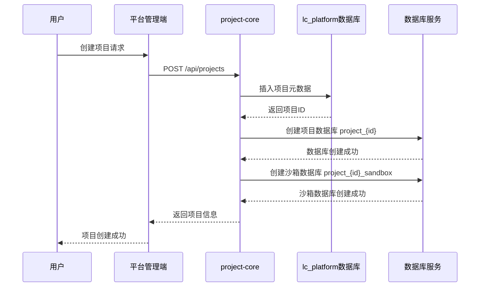
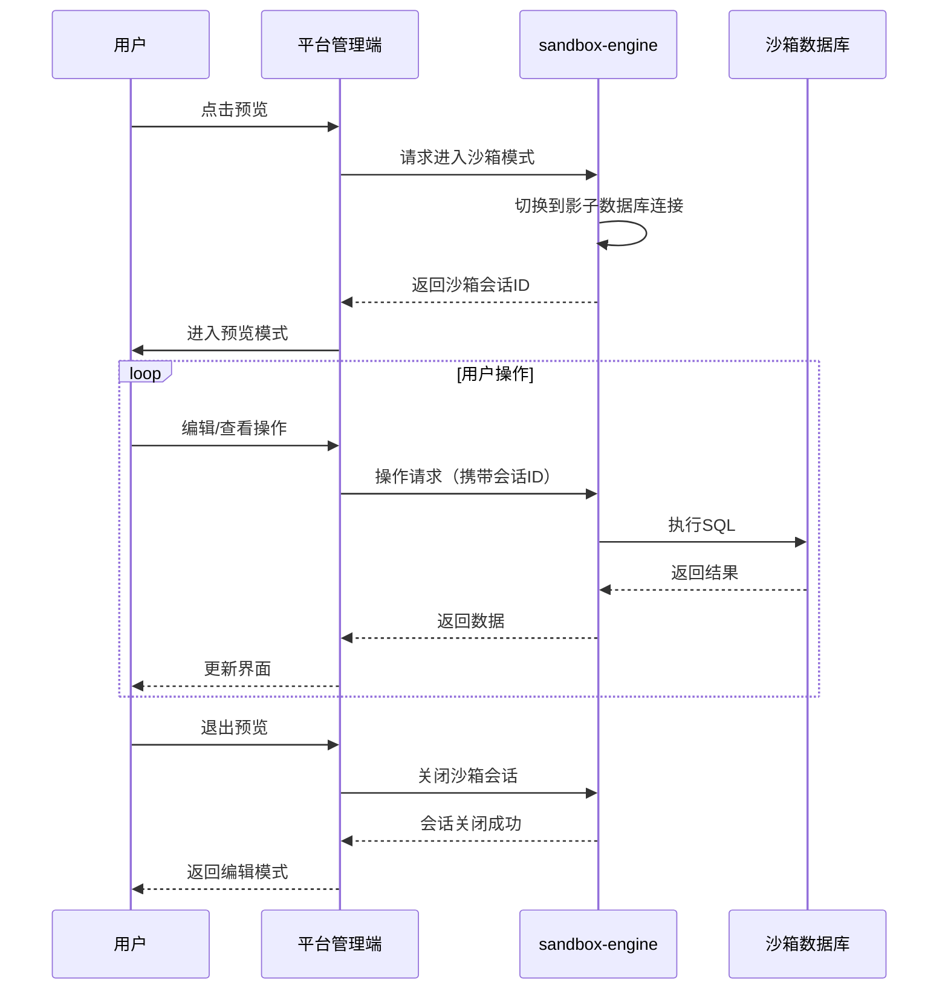
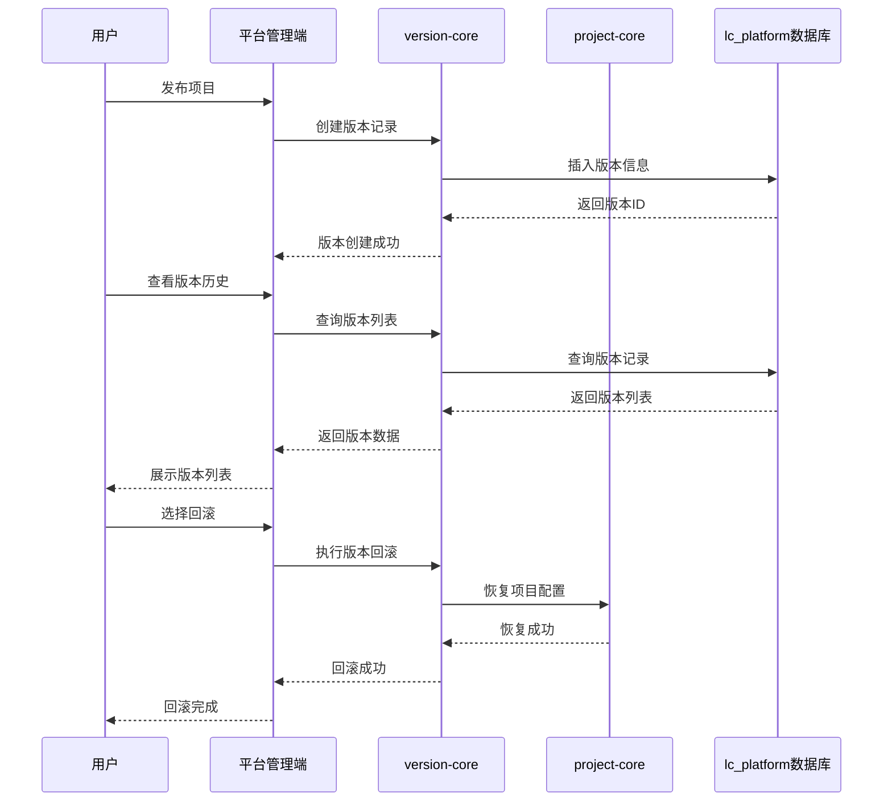
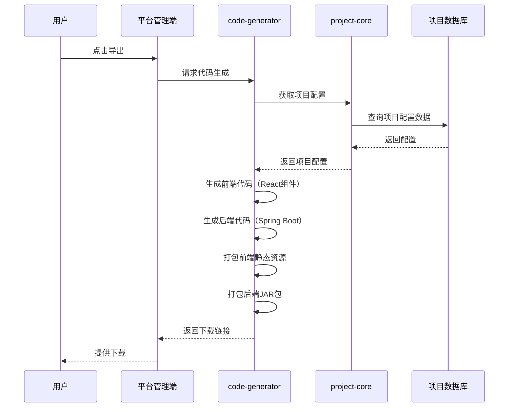
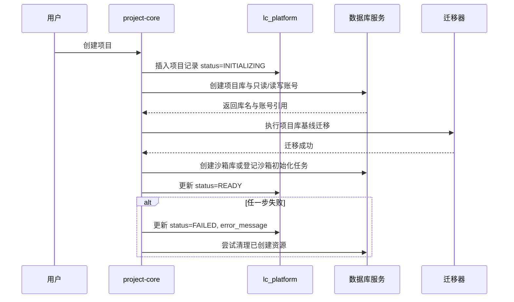
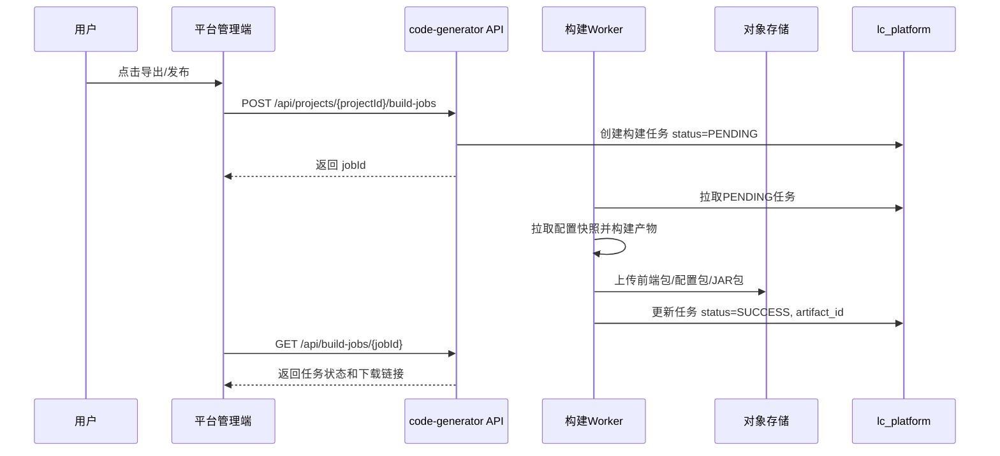
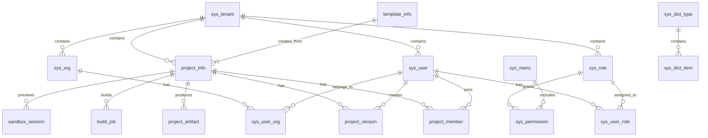
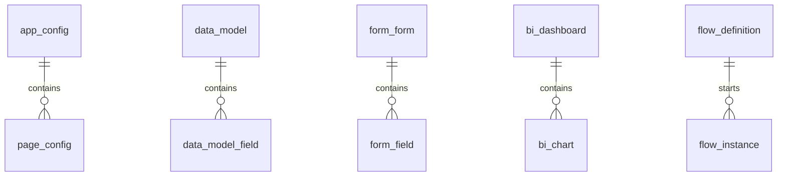
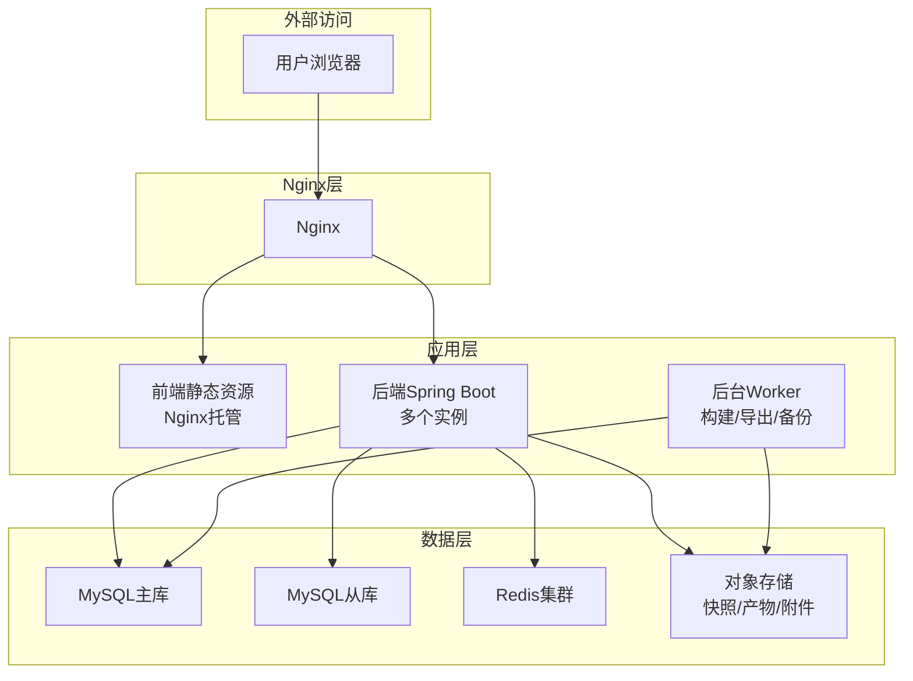
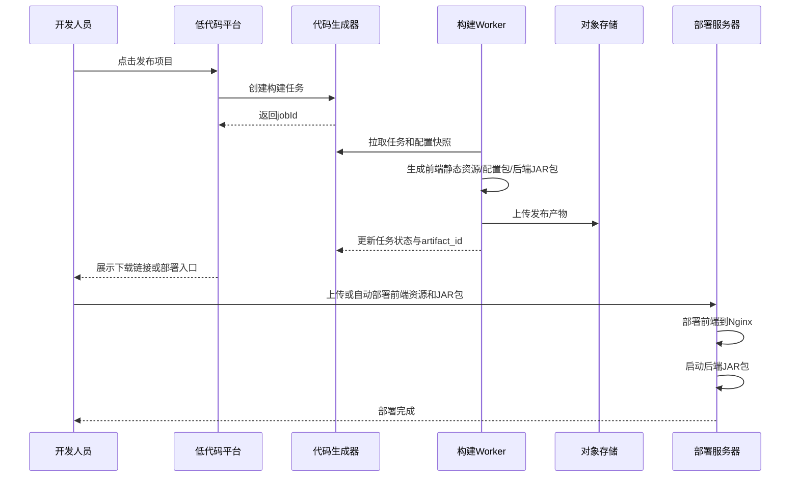

# 低代码平台详细设计文档

## 1. 概述

### 1.1 文档目的
本文档为低代码平台（偏向无代码）的详细设计文档，包含系统架构、功能模块、数据库设计、接口设计等内容，作为开发实施的依据。

### 1.2 技术栈

| 层级 | 技术 | 版本 |
|------|------|------|
| 后端框架 | Spring Boot | 3.2.x |
| 前端框架 | React | 18.x |
| 前端语言 | TypeScript | 5.x |
| UI组件库 | Ant Design Pro | 6.x |
| 构建工具 | Maven | 3.9.x |
| 前端构建 | Vite | 6.x |
| 主数据库 | MySQL | 8.0+ |
| 缓存/会话 | Redis | 7.x |
| 文件/产物存储 | MinIO / S3兼容对象存储 | 建议必选 |
| 后台任务 | 数据库任务表 / Redis Stream / RabbitMQ | MVP可先用数据库任务表 |
| 沙箱隔离 | 影子数据库（Shadow DB） | - |
| 发布形式 | 前端静态资源 + 后端JAR包 | - |

### 1.3 设计原则

| 原则 | 说明 |
|------|------|
| **多租户隔离** | 基础系统共享数据库，项目级独立数据库 |
| **项目隔离** | 每个项目独立数据库，完全物理隔离 |
| **沙箱预览** | 影子数据库作为预览环境，不影响主数据 |
| **插件化设计** | 业务模块采用插件化方式加载，便于扩展 |
| **版本可控** | 支持版本记录、回滚、切换 |
| **代码生成** | 支持前端静态资源生成 + 后端JAR包导出 |

### 1.4 设计边界与MVP目标

当前设计建议分为“平台设计态”“项目运行态”“发布产物态”三层来落地：

| 层级 | 说明 | MVP要求 |
|------|------|---------|
| 平台设计态 | 租户、用户、权限、项目、页面/表单/数据源配置管理 | 必须实现 |
| 项目运行态 | 基于配置实时渲染页面、表单和数据操作 | 必须实现 |
| 发布产物态 | 将项目配置生成可下载或可部署产物 | MVP可先支持配置包 + 前端静态包，后端JAR生成后置 |

MVP优先范围：

| 范围 | 包含内容 |
|------|----------|
| P0 | 租户/用户/权限、项目CRUD、项目成员、核心配置元模型、表单建模、运行时渲染、沙箱预览、版本快照 |
| P1 | 配置导入导出、发布任务、产物存储、基础代码导出 |
| P2 | BI、流程引擎、接口编排、模板市场 |
| P3 | 运行时插件热加载、完整后端工程生成、多环境自动部署 |

> 重要约束：每项目独立数据库方案适合私有化、中小规模租户或强隔离场景。如果目标是大规模SaaS，需要在立项阶段重新评估“共享业务库 + tenant_id/project_id分区”的方案，否则连接池、迁移、备份、监控和成本压力会显著增加。

---

## 2. 系统总体架构

### 2.1 架构图

```mermaid
graph TB
    subgraph 前端层
        A[低代码平台管理端<br/>React + Ant Design Pro]
        B[项目渲染引擎]
    end

    subgraph 网关层
        C[API Gateway<br/>Spring Cloud Gateway]
    end

    subgraph 后端服务层
        D[系统核心模块<br/>system-core]
        E[项目核心模块<br/>project-core]
        F[版本管理模块<br/>version-core]
        G[模板市场模块<br/>template-core]
        H[成员管理模块<br/>member-core]
        I[沙箱引擎<br/>sandbox-engine]
        J[代码生成器<br/>code-generator]
        
        subgraph 插件化业务模块
            K[数据源插件<br/>plugin-datasource]
            L[表单插件<br/>plugin-form]
            M[BI插件<br/>plugin-bi]
            N[流程插件<br/>plugin-flow]
            O[接口插件<br/>plugin-api]
        end
    end

    subgraph 数据层
        P[基础共享数据库<br/>lc_platform]
        Q[项目独立数据库<br/>project_{project_id}]
        R[沙箱数据库<br/>project_{project_id}_sandbox]
        S[Redis缓存]
    end

    A --> C
    B --> C
    C --> D
    C --> E
    C --> F
    C --> G
    C --> H
    C --> I
    C --> J
    C --> K
    C --> L
    C --> M
    C --> N
    C --> O
    
    D --> P
    E --> P
    E --> Q
    F --> P
    G --> P
    H --> P
    I --> R
    J --> Q
    
    K --> Q
    L --> Q
    M --> Q
    N --> Q
    O --> Q
    
    D --> S
    E --> S
```

### 2.2 模块职责

| 模块 | 职责说明 |
|------|----------|
| **system-core** | 租户管理、用户管理、权限管理、角色管理、菜单管理、组织管理、字典管理 |
| **project-core** | 项目CRUD、项目预览、项目导出、项目源码生成 |
| **version-core** | 版本记录、版本回滚、版本切换 |
| **template-core** | 模板管理、模板导入导出 |
| **member-core** | 成员邀请、角色分配（只读/编辑/管理员/发布者） |
| **plugin-datasource** | 数据源配置、连接管理 |
| **plugin-form** | 表单配置、表单渲染 |
| **plugin-bi** | 可视化配置、图表渲染 |
| **plugin-flow** | 流程配置、流程引擎 |
| **plugin-api** | 接口配置、数据交互 |
| **sandbox-engine** | 影子数据库管理、实时预览 |
| **code-generator** | 前端/后端代码生成、打包部署 |

#### 2.2.1 架构落地建议

MVP阶段建议采用“单体应用 + 多Maven模块”的方式实现上表模块职责，避免过早拆成多个微服务。`Spring Cloud Gateway` 可以作为可选部署组件保留，但不应成为MVP的强依赖。

| 模块边界 | MVP实现方式 | 后续演进 |
|----------|-------------|----------|
| system-core / project-core / member-core | 同一Spring Boot应用内模块 | 用户量增长后按领域拆服务 |
| plugin-* | 先作为内置业务模块 | 后续抽象插件SPI与manifest |
| sandbox-engine | 独立服务类 + 数据源路由 | 高并发预览时拆独立服务 |
| code-generator | 异步任务 worker | 构建量增长后拆独立构建集群 |

“插件化设计”在MVP中应定义为模块化扩展，而不是运行时热插拔。若要支持第三方插件，必须另行设计插件清单、权限边界、前端扩展点、后端SPI、数据库迁移和版本兼容策略。

### 2.3 核心流程图

#### 2.3.1 项目创建流程



#### 2.3.2 沙箱预览流程



#### 2.3.3 版本管理流程



#### 2.3.4 代码生成流程



#### 2.3.5 项目数据库生命周期流程

项目数据库创建、删除、迁移必须具备明确状态和补偿机制：



删除项目不应直接物理删除数据库。建议流程为 `ARCHIVED -> PENDING_DELETE -> BACKED_UP -> DELETED`，并由后台任务完成备份和延迟清理。默认保留期建议不少于7天，可按租户配置。

#### 2.3.6 发布/导出异步流程

代码生成和数据导出应以异步任务执行，避免HTTP请求长时间占用连接：



---

## 3. 功能模块详细设计

### 3.1 系统管理模块

#### 3.1.1 租户管理

| 功能点 | 描述 |
|--------|------|
| 租户列表 | 展示所有租户，支持分页、搜索 |
| 租户创建 | 创建新租户，设置租户名称、域名、有效期 |
| 租户编辑 | 修改租户信息 |
| 租户删除 | 删除租户（级联删除相关数据） |
| 租户状态 | 启用/禁用租户 |

#### 3.1.2 用户管理

| 功能点 | 描述 |
|--------|------|
| 用户列表 | 展示租户下所有用户，支持分页、搜索 |
| 用户创建 | 创建新用户，分配角色 |
| 用户编辑 | 修改用户信息、密码重置 |
| 用户删除 | 删除用户 |
| 用户状态 | 启用/禁用用户 |

#### 3.1.3 角色管理

| 功能点 | 描述 |
|--------|------|
| 角色列表 | 展示所有角色 |
| 角色创建 | 创建角色，设置角色名称、描述 |
| 角色编辑 | 修改角色信息 |
| 角色删除 | 删除角色 |
| 角色权限配置 | 为角色分配菜单权限和操作权限 |

#### 3.1.4 菜单管理

| 功能点 | 描述 |
|--------|------|
| 菜单列表 | 树形展示所有菜单 |
| 菜单创建 | 创建新菜单，设置父级、路径、图标 |
| 菜单编辑 | 修改菜单信息 |
| 菜单删除 | 删除菜单 |
| 菜单排序 | 调整菜单顺序 |

#### 3.1.5 组织管理

| 功能点 | 描述 |
|--------|------|
| 组织架构 | 树形展示组织架构 |
| 组织创建 | 创建部门/团队 |
| 组织编辑 | 修改组织信息 |
| 组织删除 | 删除组织 |
| 成员分配 | 为组织分配成员 |

#### 3.1.6 字典管理

| 功能点 | 描述 |
|--------|------|
| 字典列表 | 展示所有字典类型 |
| 字典创建 | 创建字典类型 |
| 字典项管理 | 管理字典下的键值对 |

### 3.2 项目管理模块

#### 3.2.1 项目CRUD

| 功能点 | 描述 |
|--------|------|
| 项目列表 | 展示租户下所有项目，支持分页、搜索、筛选 |
| 项目创建 | 创建新项目，自动创建独立数据库和沙箱数据库 |
| 项目编辑 | 修改项目基本信息（名称、描述、状态） |
| 项目删除 | 删除项目（级联删除项目数据库） |
| 项目状态 | 启用/禁用项目 |

#### 3.2.2 项目预览

| 功能点 | 描述 |
|--------|------|
| 沙箱预览 | 进入沙箱模式预览项目效果 |
| 实时编辑 | 在预览模式下实时编辑 |
| 预览退出 | 退出沙箱模式，保留沙箱数据 |

#### 3.2.3 项目导出

| 功能点 | 描述 |
|--------|------|
| 代码导出 | 导出前端静态资源和后端JAR包 |
| 配置导出 | 导出项目配置文件 |
| 数据导出 | 导出项目业务数据 |

#### 3.2.4 项目源码生成

| 功能点 | 描述 |
|--------|------|
| 前端代码生成 | 生成React组件代码 |
| 后端代码生成 | 生成Spring Boot服务代码 |
| 配置文件生成 | 生成application.yml等配置文件 |

### 3.3 版本管理模块

#### 3.3.1 版本记录

| 功能点 | 描述 |
|--------|------|
| 版本列表 | 展示项目所有版本记录 |
| 版本创建 | 发布项目时自动创建版本 |
| 版本详情 | 查看版本变更内容 |

#### 3.3.2 版本回滚

| 功能点 | 描述 |
|--------|------|
| 回滚操作 | 恢复到指定版本 |
| 回滚预览 | 预览回滚效果 |
| 回滚确认 | 确认回滚操作 |

#### 3.3.3 版本切换

| 功能点 | 描述 |
|--------|------|
| 版本切换 | 临时切换到指定版本预览 |
| 切换确认 | 确认切换回当前版本 |

### 3.4 模板市场模块

#### 3.4.1 模板管理

| 功能点 | 描述 |
|--------|------|
| 模板列表 | 展示所有模板 |
| 模板创建 | 创建新模板 |
| 模板编辑 | 修改模板信息 |
| 模板删除 | 删除模板 |
| 模板状态 | 启用/禁用模板 |

#### 3.4.2 模板导入导出

| 功能点 | 描述 |
|--------|------|
| 模板导入 | 从文件导入模板 |
| 模板导出 | 将模板导出为文件 |
| 模板应用 | 将模板应用到项目 |

### 3.5 项目成员管理模块

#### 3.5.1 成员管理

| 功能点 | 描述 |
|--------|------|
| 成员列表 | 展示项目所有成员 |
| 成员邀请 | 邀请同租户下的其他成员 |
| 成员移除 | 移除项目成员 |
| 角色分配 | 分配角色（只读/编辑/管理员/发布者） |

#### 3.5.2 角色权限

| 角色 | 权限说明 |
|------|----------|
| 只读 | 只能查看项目，不能编辑 |
| 编辑 | 可以编辑项目内容，不能发布 |
| 管理员 | 完全管理权限，包括成员管理 |
| 发布者 | 可以编辑和发布项目 |

#### 3.5.3 并发冲突处理

| 机制 | 描述 |
|------|------|
| 乐观锁 | 通过版本号检测冲突 |
| 实时协作 | 基于WebSocket实现实时同步 |
| 冲突提示 | 检测到冲突时提示用户选择覆盖或合并 |

### 3.6 数据源管理插件

#### 3.6.1 数据源配置

| 功能点 | 描述 |
|--------|------|
| 数据源列表 | 展示项目所有数据源 |
| 数据源创建 | 创建新数据源（MySQL、SQLite、API等） |
| 数据源编辑 | 修改数据源配置 |
| 数据源删除 | 删除数据源 |
| 连接测试 | 测试数据源连接 |

### 3.7 表单管理插件

#### 3.7.1 表单配置

| 功能点 | 描述 |
|--------|------|
| 表单列表 | 展示项目所有表单 |
| 表单创建 | 创建新表单，拖拽式配置 |
| 表单编辑 | 编辑表单配置 |
| 表单删除 | 删除表单 |
| 表单预览 | 预览表单效果 |

#### 3.7.2 表单组件

| 组件类型 | 描述 |
|----------|------|
| 文本输入 | 单行文本输入 |
| 文本域 | 多行文本输入 |
| 数字输入 | 数字输入框 |
| 日期选择 | 日期选择器 |
| 时间选择 | 时间选择器 |
| 下拉选择 | 下拉菜单 |
| 单选框 | 单选选项 |
| 复选框 | 多选选项 |
| 文件上传 | 文件上传组件 |

### 3.8 BI管理插件

#### 3.8.1 可视化配置

| 功能点 | 描述 |
|--------|------|
| 仪表盘列表 | 展示项目所有仪表盘 |
| 仪表盘创建 | 创建新仪表盘 |
| 仪表盘编辑 | 编辑仪表盘布局 |
| 仪表盘删除 | 删除仪表盘 |

#### 3.8.2 图表组件

| 图表类型 | 描述 |
|----------|------|
| 柱状图 | 柱状数据展示 |
| 折线图 | 趋势数据展示 |
| 饼图 | 占比数据展示 |
| 环形图 | 环形占比展示 |
| 表格 | 数据表格展示 |
| 指标卡 | 关键指标展示 |

### 3.9 流程管理插件

#### 3.9.1 流程配置

| 功能点 | 描述 |
|--------|------|
| 流程列表 | 展示项目所有流程 |
| 流程创建 | 创建新流程，拖拽式配置 |
| 流程编辑 | 编辑流程配置 |
| 流程删除 | 删除流程 |
| 流程测试 | 测试流程执行 |

#### 3.9.2 流程节点

| 节点类型 | 描述 |
|----------|------|
| 开始节点 | 流程起点 |
| 结束节点 | 流程终点 |
| 审批节点 | 审批环节 |
| 条件节点 | 条件判断 |
| 并行节点 | 并行执行 |
| 子流程 | 嵌套子流程 |

### 3.10 接口管理插件

#### 3.10.1 接口配置

| 功能点 | 描述 |
|--------|------|
| 接口列表 | 展示项目所有接口 |
| 接口创建 | 创建新接口配置 |
| 接口编辑 | 编辑接口配置 |
| 接口删除 | 删除接口 |
| 接口测试 | 测试接口调用 |

#### 3.10.2 接口类型

| 类型 | 描述 |
|------|------|
| REST API | RESTful接口 |
| GraphQL | GraphQL接口 |
| WebSocket | WebSocket接口 |
| 内部服务 | 平台内部服务调用 |

### 3.11 低代码核心元模型

低代码平台的核心不是单个插件表，而是一套可被“设计器、运行时、版本系统、模板系统、代码生成器”共同消费的项目配置模型。建议所有业务插件围绕统一元模型扩展。

| 元素 | 说明 | 关键字段 |
|------|------|----------|
| Application | 项目应用根节点 | appId、projectId、name、schemaVersion、theme、globalState |
| Page | 页面/路由配置 | pageId、path、title、layout、permission、componentTree |
| Component | 组件节点 | componentId、type、props、style、events、children |
| DataModel | 业务数据模型 | modelId、tableName、fields、indexes、relations、validationRules |
| DataSource | 数据源配置 | datasourceId、type、connectionRef、capabilities |
| Action | 交互动作 | actionId、trigger、steps、errorHandler、transactionPolicy |
| PermissionRule | 权限规则 | subject、resource、action、condition |
| Asset | 文件/图片/附件 | assetId、storageKey、mimeType、size、hash |

#### 3.11.1 配置DSL建议

项目配置建议以 JSON Schema 约束，存储时记录 `schema_version`，发布时固化为不可变快照。示例结构：

```json
{
  "schemaVersion": "1.0.0",
  "project": {
    "id": "10001",
    "code": "crm_demo",
    "name": "CRM演示项目"
  },
  "pages": [],
  "dataModels": [],
  "dataSources": [],
  "actions": [],
  "permissions": [],
  "assets": []
}
```

配置变更必须经过校验：

| 校验项 | 说明 |
|--------|------|
| Schema校验 | JSON结构、字段类型、必填项、枚举值 |
| 引用完整性 | 页面引用的组件、数据源、动作必须存在 |
| 权限校验 | 编辑者只能修改有权限的项目资源 |
| 兼容性校验 | 旧版本配置需要通过迁移器升级到当前 `schema_version` |

#### 3.11.2 运行时渲染原则

| 原则 | 说明 |
|------|------|
| 配置驱动 | 运行时只读取已校验配置，不拼接任意SQL或执行任意脚本 |
| 组件白名单 | 页面组件由平台注册表提供，禁止加载未知远程组件 |
| 动作沙箱 | API调用、数据写入、流程触发通过受控动作执行器完成 |
| 权限前后端双校验 | 前端隐藏无权操作，后端按租户、项目、角色再次校验 |

### 3.12 协作与审计

实时协作可以作为后续增强；MVP应至少实现乐观锁和审计日志。

| 能力 | MVP方案 | 后续增强 |
|------|---------|----------|
| 并发编辑 | 表级 `version` 字段 + `If-Match` / version参数 | WebSocket协同编辑、操作日志合并 |
| 审计日志 | 记录登录、权限变更、项目配置变更、发布、回滚、数据源测试 | 可视化审计检索、风险告警 |
| 变更差异 | 保存配置快照hash和JSON diff | 可视化diff、按模块回滚 |

---

## 4. 数据库设计

### 4.1 基础共享数据库（lc_platform）

#### 4.1.0 数据库通用约定

| 约定 | 说明 |
|------|------|
| 多租户唯一约束 | 租户内唯一字段使用 `(tenant_id, code)` 复合唯一，不使用全局唯一，公共资源除外 |
| 删除策略 | 业务主表默认使用软删除字段 `deleted`，物理删除由后台任务按保留策略执行 |
| 并发控制 | 可编辑配置表增加 `version` 字段，更新时做乐观锁校验 |
| JSON字段 | MySQL 8.0建议使用 `JSON` 类型；若使用 `TEXT`，应用层必须做JSON Schema校验 |
| 外键策略 | 同一数据库内可使用物理外键；跨项目库和平台库只使用逻辑外键 |
| 时间字段 | 所有业务表统一 `created_by`、`created_time`、`updated_by`、`updated_time` |
| 敏感字段 | 密码、密钥、Token、连接串不得明文落库，统一存储密文或密钥引用 |

#### 4.1.1 租户表（sys_tenant）

| 字段名 | 类型 | 约束 | 说明 |
|--------|------|------|------|
| id | BIGINT | PRIMARY KEY, AUTO_INCREMENT | 租户ID |
| tenant_code | VARCHAR(64) | UNIQUE, NOT NULL | 租户编码 |
| tenant_name | VARCHAR(128) | NOT NULL | 租户名称 |
| domain | VARCHAR(256) | NULL | 租户域名 |
| status | TINYINT | DEFAULT 1 | 状态：0-禁用，1-启用 |
| expire_time | DATETIME | NULL | 过期时间 |
| created_by | BIGINT | NOT NULL | 创建人ID |
| created_time | DATETIME | DEFAULT CURRENT_TIMESTAMP | 创建时间 |
| updated_by | BIGINT | NULL | 更新人ID |
| updated_time | DATETIME | ON UPDATE CURRENT_TIMESTAMP | 更新时间 |

#### 4.1.2 用户表（sys_user）

| 字段名 | 类型 | 约束 | 说明 |
|--------|------|------|------|
| id | BIGINT | PRIMARY KEY, AUTO_INCREMENT | 用户ID |
| tenant_id | BIGINT | NOT NULL, FOREIGN KEY | 租户ID |
| username | VARCHAR(64) | NOT NULL, UNIQUE(tenant_id, username) | 用户名，租户内唯一 |
| password | VARCHAR(256) | NOT NULL | 密码（加密） |
| real_name | VARCHAR(64) | NULL | 真实姓名 |
| email | VARCHAR(128) | NULL | 邮箱 |
| phone | VARCHAR(32) | NULL | 手机号 |
| avatar | VARCHAR(512) | NULL | 头像地址 |
| status | TINYINT | DEFAULT 1 | 状态：0-禁用，1-启用 |
| created_by | BIGINT | NOT NULL | 创建人ID |
| created_time | DATETIME | DEFAULT CURRENT_TIMESTAMP | 创建时间 |
| updated_by | BIGINT | NULL | 更新人ID |
| updated_time | DATETIME | ON UPDATE CURRENT_TIMESTAMP | 更新时间 |

#### 4.1.3 角色表（sys_role）

| 字段名 | 类型 | 约束 | 说明 |
|--------|------|------|------|
| id | BIGINT | PRIMARY KEY, AUTO_INCREMENT | 角色ID |
| tenant_id | BIGINT | NOT NULL, FOREIGN KEY | 租户ID |
| role_code | VARCHAR(64) | NOT NULL, UNIQUE(tenant_id, role_code) | 角色编码，租户内唯一 |
| role_name | VARCHAR(128) | NOT NULL | 角色名称 |
| description | VARCHAR(512) | NULL | 角色描述 |
| status | TINYINT | DEFAULT 1 | 状态：0-禁用，1-启用 |
| created_by | BIGINT | NOT NULL | 创建人ID |
| created_time | DATETIME | DEFAULT CURRENT_TIMESTAMP | 创建时间 |
| updated_by | BIGINT | NULL | 更新人ID |
| updated_time | DATETIME | ON UPDATE CURRENT_TIMESTAMP | 更新时间 |

#### 4.1.3.1 用户角色关联表（sys_user_role）

| 字段名 | 类型 | 约束 | 说明 |
|--------|------|------|------|
| id | BIGINT | PRIMARY KEY, AUTO_INCREMENT | ID |
| tenant_id | BIGINT | NOT NULL, FOREIGN KEY | 租户ID |
| user_id | BIGINT | NOT NULL, FOREIGN KEY, UNIQUE(user_id, role_id) | 用户ID |
| role_id | BIGINT | NOT NULL, FOREIGN KEY | 角色ID |
| created_by | BIGINT | NOT NULL | 创建人ID |
| created_time | DATETIME | DEFAULT CURRENT_TIMESTAMP | 创建时间 |

#### 4.1.4 菜单表（sys_menu）

| 字段名 | 类型 | 约束 | 说明 |
|--------|------|------|------|
| id | BIGINT | PRIMARY KEY, AUTO_INCREMENT | 菜单ID |
| parent_id | BIGINT | DEFAULT 0 | 父菜单ID |
| menu_name | VARCHAR(128) | NOT NULL | 菜单名称 |
| path | VARCHAR(256) | NULL | 路由路径 |
| component | VARCHAR(256) | NULL | 组件路径 |
| icon | VARCHAR(64) | NULL | 图标 |
| sort_order | INT | DEFAULT 0 | 排序号 |
| menu_type | TINYINT | NOT NULL | 类型：0-目录，1-菜单，2-按钮 |
| status | TINYINT | DEFAULT 1 | 状态：0-禁用，1-启用 |
| created_by | BIGINT | NOT NULL | 创建人ID |
| created_time | DATETIME | DEFAULT CURRENT_TIMESTAMP | 创建时间 |
| updated_by | BIGINT | NULL | 更新人ID |
| updated_time | DATETIME | ON UPDATE CURRENT_TIMESTAMP | 更新时间 |

#### 4.1.5 权限表（sys_permission）

| 字段名 | 类型 | 约束 | 说明 |
|--------|------|------|------|
| id | BIGINT | PRIMARY KEY, AUTO_INCREMENT | 权限ID |
| role_id | BIGINT | NOT NULL, FOREIGN KEY | 角色ID |
| menu_id | BIGINT | NOT NULL, FOREIGN KEY | 菜单ID |
| permissions | VARCHAR(512) | NULL | 操作权限（逗号分隔） |
| created_time | DATETIME | DEFAULT CURRENT_TIMESTAMP | 创建时间 |

#### 4.1.6 组织表（sys_org）

| 字段名 | 类型 | 约束 | 说明 |
|--------|------|------|------|
| id | BIGINT | PRIMARY KEY, AUTO_INCREMENT | 组织ID |
| tenant_id | BIGINT | NOT NULL, FOREIGN KEY | 租户ID |
| parent_id | BIGINT | DEFAULT 0 | 父组织ID |
| org_name | VARCHAR(128) | NOT NULL | 组织名称 |
| org_code | VARCHAR(64) | UNIQUE(tenant_id, org_code) | 组织编码，租户内唯一 |
| org_type | TINYINT | DEFAULT 1 | 类型：1-部门，2-团队 |
| sort_order | INT | DEFAULT 0 | 排序号 |
| created_by | BIGINT | NOT NULL | 创建人ID |
| created_time | DATETIME | DEFAULT CURRENT_TIMESTAMP | 创建时间 |
| updated_by | BIGINT | NULL | 更新人ID |
| updated_time | DATETIME | ON UPDATE CURRENT_TIMESTAMP | 更新时间 |

#### 4.1.7 用户组织关联表（sys_user_org）

| 字段名 | 类型 | 约束 | 说明 |
|--------|------|------|------|
| id | BIGINT | PRIMARY KEY, AUTO_INCREMENT | ID |
| user_id | BIGINT | NOT NULL, FOREIGN KEY | 用户ID |
| org_id | BIGINT | NOT NULL, FOREIGN KEY | 组织ID |
| created_time | DATETIME | DEFAULT CURRENT_TIMESTAMP | 创建时间 |

#### 4.1.8 字典类型表（sys_dict_type）

| 字段名 | 类型 | 约束 | 说明 |
|--------|------|------|------|
| id | BIGINT | PRIMARY KEY, AUTO_INCREMENT | ID |
| tenant_id | BIGINT | NOT NULL, FOREIGN KEY | 租户ID |
| dict_code | VARCHAR(64) | NOT NULL, UNIQUE(tenant_id, dict_code) | 字典编码，租户内唯一 |
| dict_name | VARCHAR(128) | NOT NULL | 字典名称 |
| description | VARCHAR(512) | NULL | 描述 |
| status | TINYINT | DEFAULT 1 | 状态：0-禁用，1-启用 |
| created_by | BIGINT | NOT NULL | 创建人ID |
| created_time | DATETIME | DEFAULT CURRENT_TIMESTAMP | 创建时间 |
| updated_by | BIGINT | NULL | 更新人ID |
| updated_time | DATETIME | ON UPDATE CURRENT_TIMESTAMP | 更新时间 |

#### 4.1.9 字典项表（sys_dict_item）

| 字段名 | 类型 | 约束 | 说明 |
|--------|------|------|------|
| id | BIGINT | PRIMARY KEY, AUTO_INCREMENT | ID |
| dict_type_id | BIGINT | NOT NULL, FOREIGN KEY | 字典类型ID |
| item_key | VARCHAR(64) | NOT NULL | 字典键 |
| item_value | VARCHAR(256) | NOT NULL | 字典值 |
| sort_order | INT | DEFAULT 0 | 排序号 |
| status | TINYINT | DEFAULT 1 | 状态：0-禁用，1-启用 |
| created_time | DATETIME | DEFAULT CURRENT_TIMESTAMP | 创建时间 |

#### 4.1.10 项目信息表（project_info）

| 字段名 | 类型 | 约束 | 说明 |
|--------|------|------|------|
| id | BIGINT | PRIMARY KEY, AUTO_INCREMENT | 项目ID |
| tenant_id | BIGINT | NOT NULL, FOREIGN KEY | 租户ID |
| project_name | VARCHAR(128) | NOT NULL | 项目名称 |
| project_code | VARCHAR(64) | NOT NULL, UNIQUE(tenant_id, project_code) | 项目编码，租户内唯一 |
| description | VARCHAR(1024) | NULL | 项目描述 |
| db_name | VARCHAR(128) | NOT NULL | 数据库名称 |
| sandbox_db_name | VARCHAR(128) | NULL | 沙箱数据库名称 |
| schema_version | VARCHAR(32) | DEFAULT '1.0.0' | 当前项目配置Schema版本 |
| lifecycle_status | VARCHAR(32) | DEFAULT 'INITIALIZING' | 生命周期：INITIALIZING/READY/FAILED/ARCHIVED/PENDING_DELETE/DELETED |
| status | TINYINT | DEFAULT 1 | 启用状态：0-禁用，1-启用 |
| version | INT | DEFAULT 0 | 乐观锁版本 |
| deleted | TINYINT | DEFAULT 0 | 是否软删除 |
| created_by | BIGINT | NOT NULL | 创建人ID |
| created_time | DATETIME | DEFAULT CURRENT_TIMESTAMP | 创建时间 |
| updated_by | BIGINT | NULL | 更新人ID |
| updated_time | DATETIME | ON UPDATE CURRENT_TIMESTAMP | 更新时间 |
| error_message | VARCHAR(1024) | NULL | 初始化或迁移失败原因 |

#### 4.1.11 项目成员表（project_member）

| 字段名 | 类型 | 约束 | 说明 |
|--------|------|------|------|
| id | BIGINT | PRIMARY KEY, AUTO_INCREMENT | ID |
| project_id | BIGINT | NOT NULL, FOREIGN KEY, UNIQUE(project_id, user_id) | 项目ID |
| user_id | BIGINT | NOT NULL, FOREIGN KEY | 用户ID，同一项目只允许一条有效成员记录 |
| role | VARCHAR(32) | NOT NULL | 角色：viewer/editor/admin/publisher |
| status | TINYINT | DEFAULT 1 | 状态：0-禁用，1-启用 |
| created_by | BIGINT | NOT NULL | 创建人ID |
| created_time | DATETIME | DEFAULT CURRENT_TIMESTAMP | 创建时间 |
| updated_by | BIGINT | NULL | 更新人ID |
| updated_time | DATETIME | ON UPDATE CURRENT_TIMESTAMP | 更新时间 |

#### 4.1.12 项目版本表（project_version）

| 字段名 | 类型 | 约束 | 说明 |
|--------|------|------|------|
| id | BIGINT | PRIMARY KEY, AUTO_INCREMENT | 版本ID |
| project_id | BIGINT | NOT NULL, FOREIGN KEY | 项目ID |
| version_number | VARCHAR(64) | NOT NULL, UNIQUE(project_id, version_number) | 版本号，项目内唯一 |
| version_name | VARCHAR(128) | NULL | 版本名称 |
| changelog | TEXT | NULL | 变更日志 |
| schema_version | VARCHAR(32) | NOT NULL | 配置Schema版本 |
| snapshot_ref | VARCHAR(512) | NOT NULL | 配置快照对象存储地址或快照表引用 |
| snapshot_hash | VARCHAR(128) | NOT NULL | 配置快照hash，用于完整性校验 |
| data_snapshot_ref | VARCHAR(512) | NULL | 业务数据快照引用，按需启用 |
| artifact_id | BIGINT | NULL | 对应发布产物ID |
| version_status | VARCHAR(32) | DEFAULT 'DRAFT' | DRAFT/PUBLISHED/ROLLED_BACK/ARCHIVED |
| published_time | DATETIME | NULL | 发布时间 |
| created_by | BIGINT | NOT NULL | 创建人ID |
| created_time | DATETIME | DEFAULT CURRENT_TIMESTAMP | 创建时间 |

#### 4.1.13 模板信息表（template_info）

| 字段名 | 类型 | 约束 | 说明 |
|--------|------|------|------|
| id | BIGINT | PRIMARY KEY, AUTO_INCREMENT | 模板ID |
| tenant_id | BIGINT | NULL | 租户ID（NULL表示公共模板） |
| template_name | VARCHAR(128) | NOT NULL | 模板名称 |
| template_code | VARCHAR(64) | NOT NULL, UNIQUE(tenant_id, template_code) | 模板编码；租户模板租户内唯一；公共模板（tenant_id为NULL）需应用层校验全局唯一，建议使用生成列 tenant_scope=COALESCE(CONCAT('T',tenant_id),'PUBLIC') 配合 UNIQUE(tenant_scope, template_code) |
| description | VARCHAR(1024) | NULL | 模板描述 |
| thumbnail | VARCHAR(512) | NULL | 缩略图地址 |
| snapshot_ref | VARCHAR(512) | NULL | 模板配置快照引用 |
| schema_version | VARCHAR(32) | DEFAULT '1.0.0' | 模板配置Schema版本 |
| status | TINYINT | DEFAULT 1 | 状态：0-禁用，1-启用 |
| created_by | BIGINT | NOT NULL | 创建人ID |
| created_time | DATETIME | DEFAULT CURRENT_TIMESTAMP | 创建时间 |
| updated_by | BIGINT | NULL | 更新人ID |
| updated_time | DATETIME | ON UPDATE CURRENT_TIMESTAMP | 更新时间 |

#### 4.1.14 项目发布产物表（project_artifact）

| 字段名 | 类型 | 约束 | 说明 |
|--------|------|------|------|
| id | BIGINT | PRIMARY KEY, AUTO_INCREMENT | 产物ID |
| project_id | BIGINT | NOT NULL, FOREIGN KEY | 项目ID |
| version_id | BIGINT | NULL, FOREIGN KEY | 版本ID |
| artifact_type | VARCHAR(32) | NOT NULL | 类型：config/frontend/backend/data |
| storage_key | VARCHAR(512) | NOT NULL | 对象存储Key |
| file_name | VARCHAR(256) | NOT NULL | 文件名 |
| file_size | BIGINT | NOT NULL | 文件大小 |
| content_hash | VARCHAR(128) | NOT NULL | 文件hash |
| status | VARCHAR(32) | DEFAULT 'AVAILABLE' | AVAILABLE/EXPIRED/DELETED |
| created_by | BIGINT | NOT NULL | 创建人ID |
| created_time | DATETIME | DEFAULT CURRENT_TIMESTAMP | 创建时间 |

#### 4.1.15 构建任务表（build_job）

| 字段名 | 类型 | 约束 | 说明 |
|--------|------|------|------|
| id | BIGINT | PRIMARY KEY, AUTO_INCREMENT | 任务ID |
| project_id | BIGINT | NOT NULL, FOREIGN KEY | 项目ID |
| version_id | BIGINT | NULL, FOREIGN KEY | 版本ID |
| job_type | VARCHAR(32) | NOT NULL | 类型：export_config/export_frontend/export_backend/export_data/publish |
| status | VARCHAR(32) | NOT NULL | PENDING/RUNNING/SUCCESS/FAILED/CANCELED |
| progress | INT | DEFAULT 0 | 进度百分比 |
| request_params | JSON | NULL | 构建参数 |
| artifact_id | BIGINT | NULL | 成功后生成的产物ID |
| error_message | TEXT | NULL | 失败原因 |
| started_time | DATETIME | NULL | 开始时间 |
| finished_time | DATETIME | NULL | 完成时间 |
| created_by | BIGINT | NOT NULL | 创建人ID |
| created_time | DATETIME | DEFAULT CURRENT_TIMESTAMP | 创建时间 |

#### 4.1.16 审计日志表（audit_log）

| 字段名 | 类型 | 约束 | 说明 |
|--------|------|------|------|
| id | BIGINT | PRIMARY KEY, AUTO_INCREMENT | 日志ID |
| tenant_id | BIGINT | NOT NULL | 租户ID |
| project_id | BIGINT | NULL | 项目ID |
| user_id | BIGINT | NULL | 操作用户ID |
| action | VARCHAR(128) | NOT NULL | 操作类型 |
| resource_type | VARCHAR(64) | NOT NULL | 资源类型 |
| resource_id | VARCHAR(128) | NULL | 资源ID |
| request_id | VARCHAR(64) | NULL | 请求ID |
| client_ip | VARCHAR(64) | NULL | 客户端IP |
| before_data | JSON | NULL | 变更前摘要，敏感字段脱敏 |
| after_data | JSON | NULL | 变更后摘要，敏感字段脱敏 |
| result | VARCHAR(32) | NOT NULL | SUCCESS/FAILED |
| created_time | DATETIME | DEFAULT CURRENT_TIMESTAMP | 创建时间 |

#### 4.1.17 沙箱会话表（sandbox_session）

| 字段名 | 类型 | 约束 | 说明 |
|--------|------|------|------|
| id | BIGINT | PRIMARY KEY, AUTO_INCREMENT | 会话ID |
| project_id | BIGINT | NOT NULL, FOREIGN KEY | 项目ID |
| user_id | BIGINT | NOT NULL, FOREIGN KEY | 创建用户ID |
| base_version_id | BIGINT | NULL, FOREIGN KEY | 沙箱基于的版本ID |
| sandbox_db_name | VARCHAR(128) | NOT NULL | 沙箱数据库名称 |
| status | VARCHAR(32) | NOT NULL | ACTIVE/EXPIRED/CLOSED/FAILED |
| reset_policy | VARCHAR(32) | DEFAULT 'ON_DEMAND' | ON_ENTER/ON_DEMAND/KEEP_UNTIL_EXPIRE |
| expire_time | DATETIME | NULL | 过期时间 |
| created_time | DATETIME | DEFAULT CURRENT_TIMESTAMP | 创建时间 |
| closed_time | DATETIME | NULL | 关闭时间 |

### 4.2 项目独立数据库（project_{project_id}）

#### 4.2.0 项目库通用约定

| 约定 | 说明 |
|------|------|
| 基线迁移 | 每个项目库创建后执行统一基线迁移，记录当前 `schema_version` |
| 配置与业务分离 | 页面、表单、流程等配置表与用户业务数据表分离 |
| 动态表命名 | 用户定义的数据模型生成表时使用受控前缀，如 `biz_{model_code}` |
| SQL执行 | 动态查询必须通过查询构建器生成，禁止直接执行用户输入SQL |
| 沙箱同步 | 沙箱库从指定版本或当前项目库复制，退出不自动合并回主库 |
| 迁移记录 | 项目库需要独立迁移记录表，便于批量升级和失败重试 |

#### 4.2.1 数据源配置表（ds_datasource）

| 字段名 | 类型 | 约束 | 说明 |
|--------|------|------|------|
| id | BIGINT | PRIMARY KEY, AUTO_INCREMENT | ID |
| datasource_name | VARCHAR(128) | NOT NULL | 数据源名称 |
| datasource_type | VARCHAR(32) | NOT NULL | 类型：mysql/sqlite/api |
| connection_params | JSON | NULL | 非敏感连接参数 |
| secret_ref | VARCHAR(256) | NULL | 密钥引用，密码/Token不直接存入JSON |
| network_policy | JSON | NULL | 出站访问策略：是否允许内网、白名单、超时、代理；默认禁止访问内网 |
| status | TINYINT | DEFAULT 1 | 状态：0-禁用，1-启用 |
| version | INT | DEFAULT 0 | 乐观锁版本 |
| created_by | BIGINT | NOT NULL | 创建人ID |
| created_time | DATETIME | DEFAULT CURRENT_TIMESTAMP | 创建时间 |
| updated_by | BIGINT | NULL | 更新人ID |
| updated_time | DATETIME | ON UPDATE CURRENT_TIMESTAMP | 更新时间 |

#### 4.2.2 表单配置表（form_form）

| 字段名 | 类型 | 约束 | 说明 |
|--------|------|------|------|
| id | BIGINT | PRIMARY KEY, AUTO_INCREMENT | ID |
| form_name | VARCHAR(128) | NOT NULL | 表单名称 |
| form_code | VARCHAR(64) | UNIQUE, NOT NULL | 表单编码，仅项目库内唯一 |
| form_config | JSON | NULL | 表单配置 |
| schema_version | VARCHAR(32) | DEFAULT '1.0.0' | 表单配置Schema版本 |
| status | TINYINT | DEFAULT 1 | 状态：0-禁用，1-启用 |
| version | INT | DEFAULT 0 | 乐观锁版本 |
| deleted | TINYINT | DEFAULT 0 | 是否软删除 |
| created_by | BIGINT | NOT NULL | 创建人ID |
| created_time | DATETIME | DEFAULT CURRENT_TIMESTAMP | 创建时间 |
| updated_by | BIGINT | NULL | 更新人ID |
| updated_time | DATETIME | ON UPDATE CURRENT_TIMESTAMP | 更新时间 |

#### 4.2.3 表单字段表（form_field）

| 字段名 | 类型 | 约束 | 说明 |
|--------|------|------|------|
| id | BIGINT | PRIMARY KEY, AUTO_INCREMENT | ID |
| form_id | BIGINT | NOT NULL, FOREIGN KEY | 表单ID |
| field_name | VARCHAR(128) | NOT NULL | 字段名称 |
| field_code | VARCHAR(64) | NOT NULL, UNIQUE(form_id, field_code) | 字段编码，表单内唯一 |
| field_type | VARCHAR(32) | NOT NULL | 字段类型 |
| field_config | JSON | NULL | 字段配置 |
| sort_order | INT | DEFAULT 0 | 排序号 |
| required | TINYINT | DEFAULT 0 | 是否必填 |
| created_by | BIGINT | NOT NULL | 创建人ID |
| created_time | DATETIME | DEFAULT CURRENT_TIMESTAMP | 创建时间 |
| updated_by | BIGINT | NULL | 更新人ID |
| updated_time | DATETIME | ON UPDATE CURRENT_TIMESTAMP | 更新时间 |

#### 4.2.4 BI仪表盘表（bi_dashboard）

| 字段名 | 类型 | 约束 | 说明 |
|--------|------|------|------|
| id | BIGINT | PRIMARY KEY, AUTO_INCREMENT | ID |
| dashboard_name | VARCHAR(128) | NOT NULL | 仪表盘名称 |
| dashboard_code | VARCHAR(64) | UNIQUE, NOT NULL | 仪表盘编码，仅项目库内唯一 |
| layout_config | JSON | NULL | 布局配置 |
| status | TINYINT | DEFAULT 1 | 状态：0-禁用，1-启用 |
| created_by | BIGINT | NOT NULL | 创建人ID |
| created_time | DATETIME | DEFAULT CURRENT_TIMESTAMP | 创建时间 |
| updated_by | BIGINT | NULL | 更新人ID |
| updated_time | DATETIME | ON UPDATE CURRENT_TIMESTAMP | 更新时间 |

#### 4.2.5 BI图表表（bi_chart）

| 字段名 | 类型 | 约束 | 说明 |
|--------|------|------|------|
| id | BIGINT | PRIMARY KEY, AUTO_INCREMENT | ID |
| dashboard_id | BIGINT | NOT NULL, FOREIGN KEY | 仪表盘ID |
| chart_name | VARCHAR(128) | NOT NULL | 图表名称 |
| chart_type | VARCHAR(32) | NOT NULL | 图表类型 |
| chart_config | JSON | NULL | 图表配置 |
| x | INT | DEFAULT 0 | X坐标 |
| y | INT | DEFAULT 0 | Y坐标 |
| width | INT | DEFAULT 4 | 宽度 |
| height | INT | DEFAULT 3 | 高度 |
| created_by | BIGINT | NOT NULL | 创建人ID |
| created_time | DATETIME | DEFAULT CURRENT_TIMESTAMP | 创建时间 |
| updated_by | BIGINT | NULL | 更新人ID |
| updated_time | DATETIME | ON UPDATE CURRENT_TIMESTAMP | 更新时间 |

#### 4.2.6 流程定义表（flow_definition）

| 字段名 | 类型 | 约束 | 说明 |
|--------|------|------|------|
| id | BIGINT | PRIMARY KEY, AUTO_INCREMENT | ID |
| flow_name | VARCHAR(128) | NOT NULL | 流程名称 |
| flow_code | VARCHAR(64) | UNIQUE, NOT NULL | 流程编码，仅项目库内唯一 |
| flow_config | JSON | NULL | 流程配置 |
| status | TINYINT | DEFAULT 1 | 状态：0-禁用，1-启用 |
| created_by | BIGINT | NOT NULL | 创建人ID |
| created_time | DATETIME | DEFAULT CURRENT_TIMESTAMP | 创建时间 |
| updated_by | BIGINT | NULL | 更新人ID |
| updated_time | DATETIME | ON UPDATE CURRENT_TIMESTAMP | 更新时间 |

#### 4.2.7 流程实例表（flow_instance）

| 字段名 | 类型 | 约束 | 说明 |
|--------|------|------|------|
| id | BIGINT | PRIMARY KEY, AUTO_INCREMENT | ID |
| flow_definition_id | BIGINT | NOT NULL, FOREIGN KEY | 流程定义ID |
| business_key | VARCHAR(128) | NULL | 业务单据号或关联业务ID |
| instance_status | VARCHAR(32) | NOT NULL | 实例状态 |
| current_node_id | BIGINT | NULL | 当前节点ID |
| variables | JSON | NULL | 流程变量 |
| created_by | BIGINT | NOT NULL | 创建人ID |
| created_time | DATETIME | DEFAULT CURRENT_TIMESTAMP | 创建时间 |
| completed_time | DATETIME | NULL | 完成时间 |

#### 4.2.8 接口配置表（api_config）

| 字段名 | 类型 | 约束 | 说明 |
|--------|------|------|------|
| id | BIGINT | PRIMARY KEY, AUTO_INCREMENT | ID |
| api_name | VARCHAR(128) | NOT NULL | 接口名称 |
| api_code | VARCHAR(64) | UNIQUE, NOT NULL | 接口编码 |
| api_type | VARCHAR(32) | NOT NULL | 接口类型 |
| request_method | VARCHAR(16) | NOT NULL | 请求方法 |
| request_url | VARCHAR(512) | NOT NULL | 请求URL |
| request_params | JSON | NULL | 请求参数 |
| response_config | JSON | NULL | 响应配置 |
| auth_config_ref | VARCHAR(256) | NULL | 认证配置密钥引用 |
| timeout_ms | INT | DEFAULT 5000 | 超时时间 |
| rate_limit | VARCHAR(64) | NULL | 调用限流策略 |
| network_policy | JSON | NULL | 出站访问策略：是否允许内网、白名单、超时、代理；默认禁止访问内网 |
| status | TINYINT | DEFAULT 1 | 状态：0-禁用，1-启用 |
| created_by | BIGINT | NOT NULL | 创建人ID |
| created_time | DATETIME | DEFAULT CURRENT_TIMESTAMP | 创建时间 |
| updated_by | BIGINT | NULL | 更新人ID |
| updated_time | DATETIME | ON UPDATE CURRENT_TIMESTAMP | 更新时间 |

#### 4.2.9 应用配置表（app_config）

| 字段名 | 类型 | 约束 | 说明 |
|--------|------|------|------|
| id | BIGINT | PRIMARY KEY, AUTO_INCREMENT | ID |
| app_name | VARCHAR(128) | NOT NULL | 应用名称 |
| app_code | VARCHAR(64) | UNIQUE, NOT NULL | 应用编码 |
| schema_version | VARCHAR(32) | DEFAULT '1.0.0' | 配置Schema版本 |
| theme_config | JSON | NULL | 主题配置 |
| global_config | JSON | NULL | 全局配置 |
| version | INT | DEFAULT 0 | 乐观锁版本 |
| created_by | BIGINT | NOT NULL | 创建人ID |
| created_time | DATETIME | DEFAULT CURRENT_TIMESTAMP | 创建时间 |
| updated_by | BIGINT | NULL | 更新人ID |
| updated_time | DATETIME | ON UPDATE CURRENT_TIMESTAMP | 更新时间 |

#### 4.2.10 页面配置表（page_config）

| 字段名 | 类型 | 约束 | 说明 |
|--------|------|------|------|
| id | BIGINT | PRIMARY KEY, AUTO_INCREMENT | 页面ID |
| app_id | BIGINT | NOT NULL, FOREIGN KEY | 应用ID |
| page_name | VARCHAR(128) | NOT NULL | 页面名称 |
| page_code | VARCHAR(64) | NOT NULL, UNIQUE(app_id, page_code) | 页面编码，应用内唯一 |
| route_path | VARCHAR(256) | NOT NULL | 页面路由 |
| component_tree | JSON | NOT NULL | 组件树配置 |
| permission_config | JSON | NULL | 页面权限配置 |
| status | TINYINT | DEFAULT 1 | 状态：0-禁用，1-启用 |
| version | INT | DEFAULT 0 | 乐观锁版本 |
| created_by | BIGINT | NOT NULL | 创建人ID |
| created_time | DATETIME | DEFAULT CURRENT_TIMESTAMP | 创建时间 |
| updated_by | BIGINT | NULL | 更新人ID |
| updated_time | DATETIME | ON UPDATE CURRENT_TIMESTAMP | 更新时间 |

#### 4.2.11 数据模型表（data_model）

| 字段名 | 类型 | 约束 | 说明 |
|--------|------|------|------|
| id | BIGINT | PRIMARY KEY, AUTO_INCREMENT | 模型ID |
| model_name | VARCHAR(128) | NOT NULL | 模型名称 |
| model_code | VARCHAR(64) | UNIQUE, NOT NULL | 模型编码 |
| table_name | VARCHAR(128) | UNIQUE, NOT NULL | 受控业务表名 |
| model_config | JSON | NULL | 模型配置 |
| status | TINYINT | DEFAULT 1 | 状态：0-禁用，1-启用 |
| version | INT | DEFAULT 0 | 乐观锁版本 |
| created_by | BIGINT | NOT NULL | 创建人ID |
| created_time | DATETIME | DEFAULT CURRENT_TIMESTAMP | 创建时间 |
| updated_by | BIGINT | NULL | 更新人ID |
| updated_time | DATETIME | ON UPDATE CURRENT_TIMESTAMP | 更新时间 |

#### 4.2.12 数据模型字段表（data_model_field）

| 字段名 | 类型 | 约束 | 说明 |
|--------|------|------|------|
| id | BIGINT | PRIMARY KEY, AUTO_INCREMENT | 字段ID |
| model_id | BIGINT | NOT NULL, FOREIGN KEY | 模型ID |
| field_name | VARCHAR(128) | NOT NULL | 字段名称 |
| field_code | VARCHAR(64) | NOT NULL, UNIQUE(model_id, field_code) | 字段编码，模型内唯一 |
| column_name | VARCHAR(128) | NOT NULL | 受控数据库列名 |
| field_type | VARCHAR(32) | NOT NULL | 字段类型 |
| field_config | JSON | NULL | 校验、默认值、显示等配置 |
| required | TINYINT | DEFAULT 0 | 是否必填 |
| sort_order | INT | DEFAULT 0 | 排序号 |
| created_by | BIGINT | NOT NULL | 创建人ID |
| created_time | DATETIME | DEFAULT CURRENT_TIMESTAMP | 创建时间 |
| updated_by | BIGINT | NULL | 更新人ID |
| updated_time | DATETIME | ON UPDATE CURRENT_TIMESTAMP | 更新时间 |

### 4.3 ER图



项目独立库内部关系补充：



---

## 5. 接口设计

### 5.0 接口通用约定

| 约定 | 说明 |
|------|------|
| 路径变量命名 | 嵌套资源必须使用明确名称，如 `{projectId}`、`{formId}`，避免多个 `{id}` |
| 租户上下文 | 租户来自登录态、域名或请求头中的受信字段，禁止由普通请求参数任意指定 |
| 统一响应 | 成功返回 `{ "code": 0, "message": "ok", "data": ... }`，失败返回明确错误码和 `requestId` |
| 分页参数 | 列表接口统一支持 `pageNum`、`pageSize`、`sort`、`keyword` |
| 乐观锁 | 更新配置类资源时传入 `version` 或 `If-Match`，冲突返回 `409 CONFLICT` |
| 幂等性 | 创建项目、发布、导出、导入等高成本操作支持 `Idempotency-Key` |
| 异步任务 | 构建、导出、导入、数据库备份等返回 `202 Accepted + jobId` |
| 权限声明 | 每个接口实现必须声明所需项目角色或系统权限点 |
| 审计 | 登录、权限变更、项目配置变更、发布、回滚、数据源测试、外部接口测试必须写审计日志 |

### 5.1 系统管理接口

#### 5.1.1 租户管理

| API路径 | HTTP方法 | 所属模块 | 说明 |
|---------|----------|----------|------|
| /api/system/tenants | GET | system-core | 获取租户列表 |
| /api/system/tenants/{id} | GET | system-core | 获取租户详情 |
| /api/system/tenants | POST | system-core | 创建租户 |
| /api/system/tenants/{id} | PUT | system-core | 更新租户 |
| /api/system/tenants/{id} | DELETE | system-core | 删除租户 |
| /api/system/tenants/{id}/status | PATCH | system-core | 更新租户状态 |

#### 5.1.2 用户管理

| API路径 | HTTP方法 | 所属模块 | 说明 |
|---------|----------|----------|------|
| /api/system/users | GET | system-core | 获取用户列表 |
| /api/system/users/{id} | GET | system-core | 获取用户详情 |
| /api/system/users | POST | system-core | 创建用户 |
| /api/system/users/{id} | PUT | system-core | 更新用户 |
| /api/system/users/{id} | DELETE | system-core | 删除用户 |
| /api/system/users/{id}/status | PATCH | system-core | 更新用户状态 |
| /api/system/users/{id}/password | PUT | system-core | 重置密码 |

#### 5.1.3 角色管理

| API路径 | HTTP方法 | 所属模块 | 说明 |
|---------|----------|----------|------|
| /api/system/roles | GET | system-core | 获取角色列表 |
| /api/system/roles/{id} | GET | system-core | 获取角色详情 |
| /api/system/roles | POST | system-core | 创建角色 |
| /api/system/roles/{id} | PUT | system-core | 更新角色 |
| /api/system/roles/{id} | DELETE | system-core | 删除角色 |
| /api/system/roles/{id}/permissions | PUT | system-core | 配置角色权限 |

#### 5.1.4 菜单管理

| API路径 | HTTP方法 | 所属模块 | 说明 |
|---------|----------|----------|------|
| /api/system/menus | GET | system-core | 获取菜单列表 |
| /api/system/menus/{id} | GET | system-core | 获取菜单详情 |
| /api/system/menus | POST | system-core | 创建菜单 |
| /api/system/menus/{id} | PUT | system-core | 更新菜单 |
| /api/system/menus/{id} | DELETE | system-core | 删除菜单 |

#### 5.1.5 组织管理

| API路径 | HTTP方法 | 所属模块 | 说明 |
|---------|----------|----------|------|
| /api/system/orgs | GET | system-core | 获取组织列表 |
| /api/system/orgs/{id} | GET | system-core | 获取组织详情 |
| /api/system/orgs | POST | system-core | 创建组织 |
| /api/system/orgs/{id} | PUT | system-core | 更新组织 |
| /api/system/orgs/{id} | DELETE | system-core | 删除组织 |
| /api/system/orgs/{id}/members | POST | system-core | 分配成员 |

#### 5.1.6 字典管理

| API路径 | HTTP方法 | 所属模块 | 说明 |
|---------|----------|----------|------|
| /api/system/dict-types | GET | system-core | 获取字典类型列表 |
| /api/system/dict-types/{id} | GET | system-core | 获取字典类型详情 |
| /api/system/dict-types | POST | system-core | 创建字典类型 |
| /api/system/dict-types/{id} | PUT | system-core | 更新字典类型 |
| /api/system/dict-types/{id} | DELETE | system-core | 删除字典类型 |
| /api/system/dict-types/{id}/items | GET | system-core | 获取字典项列表 |
| /api/system/dict-types/{id}/items | POST | system-core | 创建字典项 |
| /api/system/dict-types/{id}/items/{itemId} | PUT | system-core | 更新字典项 |
| /api/system/dict-types/{id}/items/{itemId} | DELETE | system-core | 删除字典项 |

### 5.2 项目管理接口

#### 5.2.1 项目CRUD

| API路径 | HTTP方法 | 所属模块 | 说明 |
|---------|----------|----------|------|
| /api/projects | GET | project-core | 获取项目列表 |
| /api/projects/{projectId} | GET | project-core | 获取项目详情 |
| /api/projects | POST | project-core | 创建项目 |
| /api/projects/{projectId} | PUT | project-core | 更新项目 |
| /api/projects/{projectId} | DELETE | project-core | 归档项目，后台延迟物理删除 |
| /api/projects/{projectId}/status | PATCH | project-core | 更新项目状态 |
| /api/projects/{projectId}/schema | GET | project-core | 获取项目完整配置DSL |
| /api/projects/{projectId}/schema | PUT | project-core | 更新项目完整配置DSL，需乐观锁 |

#### 5.2.2 项目预览

| API路径 | HTTP方法 | 所属模块 | 说明 |
|---------|----------|----------|------|
| /api/projects/{projectId}/sandbox-sessions | POST | sandbox-engine | 创建沙箱会话 |
| /api/projects/{projectId}/sandbox-sessions/{sessionId} | GET | sandbox-engine | 获取沙箱会话状态 |
| /api/projects/{projectId}/sandbox-sessions/{sessionId}/reset | POST | sandbox-engine | 重置沙箱数据 |
| /api/projects/{projectId}/sandbox-sessions/{sessionId}/close | POST | sandbox-engine | 关闭沙箱会话 |
| /api/projects/{projectId}/sandbox-sessions/{sessionId}/data | GET | sandbox-engine | 获取沙箱预览数据 |
| /api/projects/{projectId}/sandbox-sessions/{sessionId}/data | POST | sandbox-engine | 提交沙箱预览数据 |

#### 5.2.3 项目导出

| API路径 | HTTP方法 | 所属模块 | 说明 |
|---------|----------|----------|------|
| /api/projects/{projectId}/build-jobs | POST | code-generator | 创建导出/发布任务 |
| /api/projects/{projectId}/artifacts | GET | code-generator | 获取项目产物列表 |
| /api/projects/{projectId}/artifacts/{artifactId}/download | GET | code-generator | 下载产物，需鉴权和过期控制 |

### 5.3 版本管理接口

| API路径 | HTTP方法 | 所属模块 | 说明 |
|---------|----------|----------|------|
| /api/projects/{projectId}/versions | GET | version-core | 获取版本列表 |
| /api/projects/{projectId}/versions/{versionId} | GET | version-core | 获取版本详情 |
| /api/projects/{projectId}/versions | POST | version-core | 创建版本快照 |
| /api/projects/{projectId}/versions/{versionId}/diff | GET | version-core | 获取当前配置与版本差异 |
| /api/projects/{projectId}/versions/{versionId}/rollback-preview | POST | version-core | 生成回滚预览 |
| /api/projects/{projectId}/versions/{versionId}/rollback | POST | version-core | 版本回滚，生成新的当前草稿 |
| /api/projects/{projectId}/versions/{versionId}/switch | POST | version-core | 临时切换版本预览 |

### 5.4 模板市场接口

| API路径 | HTTP方法 | 所属模块 | 说明 |
|---------|----------|----------|------|
| /api/templates | GET | template-core | 获取模板列表 |
| /api/templates/{id} | GET | template-core | 获取模板详情 |
| /api/templates | POST | template-core | 创建模板 |
| /api/templates/{id} | PUT | template-core | 更新模板 |
| /api/templates/{id} | DELETE | template-core | 删除模板 |
| /api/templates/{id}/apply | POST | template-core | 应用模板到项目 |

### 5.5 项目成员接口

| API路径 | HTTP方法 | 所属模块 | 说明 |
|---------|----------|----------|------|
| /api/projects/{projectId}/members | GET | member-core | 获取成员列表 |
| /api/projects/{projectId}/members | POST | member-core | 邀请成员 |
| /api/projects/{projectId}/members/{memberId} | PUT | member-core | 更新成员角色 |
| /api/projects/{projectId}/members/{memberId} | DELETE | member-core | 移除成员 |

### 5.6 页面与数据模型接口

| API路径 | HTTP方法 | 所属模块 | 说明 |
|---------|----------|----------|------|
| /api/projects/{projectId}/pages | GET | project-core | 获取页面列表 |
| /api/projects/{projectId}/pages/{pageId} | GET | project-core | 获取页面详情 |
| /api/projects/{projectId}/pages | POST | project-core | 创建页面 |
| /api/projects/{projectId}/pages/{pageId} | PUT | project-core | 更新页面，需乐观锁 |
| /api/projects/{projectId}/pages/{pageId} | DELETE | project-core | 删除页面 |
| /api/projects/{projectId}/data-models | GET | project-core | 获取数据模型列表 |
| /api/projects/{projectId}/data-models/{modelId} | GET | project-core | 获取数据模型详情 |
| /api/projects/{projectId}/data-models | POST | project-core | 创建数据模型并生成受控业务表 |
| /api/projects/{projectId}/data-models/{modelId} | PUT | project-core | 更新数据模型并生成迁移计划 |
| /api/projects/{projectId}/data-models/{modelId}/migrations | POST | project-core | 执行数据模型迁移 |

### 5.7 数据源接口

| API路径 | HTTP方法 | 所属模块 | 说明 |
|---------|----------|----------|------|
| /api/projects/{projectId}/datasources | GET | plugin-datasource | 获取数据源列表 |
| /api/projects/{projectId}/datasources/{datasourceId} | GET | plugin-datasource | 获取数据源详情 |
| /api/projects/{projectId}/datasources | POST | plugin-datasource | 创建数据源 |
| /api/projects/{projectId}/datasources/{datasourceId} | PUT | plugin-datasource | 更新数据源 |
| /api/projects/{projectId}/datasources/{datasourceId} | DELETE | plugin-datasource | 删除数据源 |
| /api/projects/{projectId}/datasources/{datasourceId}/test | POST | plugin-datasource | 测试连接，必须写审计日志 |

### 5.8 表单接口

| API路径 | HTTP方法 | 所属模块 | 说明 |
|---------|----------|----------|------|
| /api/projects/{projectId}/forms | GET | plugin-form | 获取表单列表 |
| /api/projects/{projectId}/forms/{formId} | GET | plugin-form | 获取表单详情 |
| /api/projects/{projectId}/forms | POST | plugin-form | 创建表单 |
| /api/projects/{projectId}/forms/{formId} | PUT | plugin-form | 更新表单，需乐观锁 |
| /api/projects/{projectId}/forms/{formId} | DELETE | plugin-form | 删除表单 |
| /api/projects/{projectId}/forms/{formId}/preview | GET | plugin-form | 预览表单 |

### 5.9 BI接口

| API路径 | HTTP方法 | 所属模块 | 说明 |
|---------|----------|----------|------|
| /api/projects/{projectId}/dashboards | GET | plugin-bi | 获取仪表盘列表 |
| /api/projects/{projectId}/dashboards/{dashboardId} | GET | plugin-bi | 获取仪表盘详情 |
| /api/projects/{projectId}/dashboards | POST | plugin-bi | 创建仪表盘 |
| /api/projects/{projectId}/dashboards/{dashboardId} | PUT | plugin-bi | 更新仪表盘 |
| /api/projects/{projectId}/dashboards/{dashboardId} | DELETE | plugin-bi | 删除仪表盘 |

### 5.10 流程接口

| API路径 | HTTP方法 | 所属模块 | 说明 |
|---------|----------|----------|------|
| /api/projects/{projectId}/flows | GET | plugin-flow | 获取流程列表 |
| /api/projects/{projectId}/flows/{flowId} | GET | plugin-flow | 获取流程详情 |
| /api/projects/{projectId}/flows | POST | plugin-flow | 创建流程 |
| /api/projects/{projectId}/flows/{flowId} | PUT | plugin-flow | 更新流程 |
| /api/projects/{projectId}/flows/{flowId} | DELETE | plugin-flow | 删除流程 |
| /api/projects/{projectId}/flows/{flowId}/instances | POST | plugin-flow | 启动流程实例 |

### 5.11 接口管理接口

| API路径 | HTTP方法 | 所属模块 | 说明 |
|---------|----------|----------|------|
| /api/projects/{projectId}/apis | GET | plugin-api | 获取接口列表 |
| /api/projects/{projectId}/apis/{apiId} | GET | plugin-api | 获取接口详情 |
| /api/projects/{projectId}/apis | POST | plugin-api | 创建接口 |
| /api/projects/{projectId}/apis/{apiId} | PUT | plugin-api | 更新接口 |
| /api/projects/{projectId}/apis/{apiId} | DELETE | plugin-api | 删除接口 |
| /api/projects/{projectId}/apis/{apiId}/test | POST | plugin-api | 测试接口，必须执行SSRF检查并写审计日志 |

### 5.12 构建任务与审计接口

| API路径 | HTTP方法 | 所属模块 | 说明 |
|---------|----------|----------|------|
| /api/build-jobs/{jobId} | GET | code-generator | 获取构建任务状态 |
| /api/build-jobs/{jobId}/cancel | POST | code-generator | 取消构建任务 |
| /api/audit-logs | GET | system-core | 查询审计日志，仅管理员可访问 |

---

## 6. 安全设计

### 6.1 认证机制

| 机制 | 说明 |
|------|------|
| JWT Token | 用户认证使用短期Access Token，建议15-30分钟过期 |
| Refresh Token | 支持令牌刷新，刷新时做Token轮换和旧Token失效 |
| Session管理 | Redis存储会话信息、设备信息、Token黑名单 |
| 登录保护 | 登录失败锁定、验证码/MFA预留、异地登录提示 |

### 6.2 授权机制

| 机制 | 说明 |
|------|------|
| RBAC权限模型 | 基于角色的访问控制 |
| 租户隔离 | 数据按租户隔离 |
| 项目隔离 | 项目级数据隔离 |
| 细粒度权限 | 支持按钮级权限控制 |
| 资源级校验 | 后端每次访问项目资源时校验 tenant_id、project_id、member role |
| 条件权限 | 预留ABAC条件表达式，如部门、创建人、数据范围 |

### 6.3 数据安全

| 机制 | 说明 |
|------|------|
| 密码加密 | BCrypt加密存储 |
| 传输加密 | HTTPS传输 |
| SQL注入防护 | 使用预编译语句 |
| XSS防护 | 前端输入过滤 |
| 密钥管理 | 数据源密码、API Token、OAuth密钥使用KMS/Vault或应用主密钥加密 |
| 数据备份 | 平台库、项目库、沙箱库按不同策略备份，项目删除前强制生成备份 |
| 数据脱敏 | 审计日志、错误日志、构建日志不得输出密钥、密码、Token |
| 文件安全 | 文件上传限制类型、大小、后缀、MIME嗅探和病毒扫描，下载需鉴权 |

### 6.4 低代码特有安全边界

| 风险 | 防护策略 |
|------|----------|
| SSRF | 用户配置的API URL必须经过域名/IP白名单检查，默认禁止访问内网、metadata地址和localhost |
| 动态SQL | 禁止执行用户手写SQL；由查询构建器生成SQL并绑定参数 |
| 远程组件 | 运行时只允许平台内置组件或已审核组件，禁止任意远程JS加载 |
| 表达式执行 | 公式、条件、动作脚本必须运行在受限解释器或沙箱内，设置超时和资源限制 |
| 数据源测试 | 测试连接必须限流、审计、隐藏敏感错误详情 |
| 跨租户越权 | 所有列表、详情、更新、删除接口必须有租户和项目成员校验测试用例 |

### 6.5 审计与合规

| 事件 | 记录内容 |
|------|----------|
| 登录/登出 | 用户、租户、IP、设备、结果 |
| 权限变更 | 操作人、目标用户/角色、变更前后权限 |
| 项目配置变更 | 项目、资源类型、版本号、配置hash、JSON diff摘要 |
| 发布/回滚 | 版本、产物、操作人、结果、失败原因 |
| 数据源/API测试 | 目标地址脱敏摘要、调用结果、耗时、风险命中情况 |

---

## 7. 部署设计

### 7.1 部署架构



部署注意事项：

| 项目 | 说明 |
|------|------|
| 数据库账号 | 平台库、项目库、沙箱库使用不同账号和最小权限 |
| 动态数据源 | 项目库数量增长时需要连接池上限、空闲回收和健康检查 |
| 备份恢复 | 项目库创建、发布、删除、迁移前后需要可追溯备份点 |
| 监控指标 | API耗时、构建队列长度、项目库连接数、沙箱数量、对象存储容量 |
| 日志链路 | 每个请求生成 `requestId`，贯穿API、Worker、审计日志 |

### 7.2 发布流程



MVP建议先支持“配置包 + 前端静态包”导出；完整后端JAR生成需要模板工程、依赖版本锁定、数据库迁移脚本、启动参数、安全配置和回归测试，建议作为独立里程碑验收。

---

## 8. 扩展性功能设计

### 8.1 可选组件

| 组件 | 说明 | 是否必选 |
|------|------|----------|
| Spring Cloud Gateway | API网关 | 否 |
| Elasticsearch | 全文搜索 | 否 |
| RabbitMQ | 消息队列；MVP可用数据库任务表替代 | 否 |
| MinIO | 对象存储；用于快照、构建产物、附件 | 是 |
| KMS/Vault | 密钥管理；MVP可用应用主密钥加密过渡 | 建议 |

### 8.2 预留扩展点

| 扩展点 | 说明 |
|--------|------|
| 插件系统 | 支持自定义插件开发 |
| 数据源扩展 | 支持自定义数据源类型 |
| 组件扩展 | 支持自定义表单/图表组件 |
| 部署扩展 | 支持自定义部署方式 |

#### 8.2.1 插件契约补充

后续若支持第三方插件，插件必须提供如下契约：

| 契约 | 说明 |
|------|------|
| manifest | 插件名称、版本、兼容平台版本、权限声明、前端入口、后端扩展点 |
| 权限边界 | 声明可访问的数据源、API、文件、项目资源 |
| 数据迁移 | 提供安装、升级、卸载迁移脚本，支持回滚 |
| 前端扩展 | 声明组件注册、设计器面板、属性编辑器、运行时渲染器 |
| 后端扩展 | 声明SPI接口、任务处理器、动作执行器 |
| 审核机制 | 插件发布前做安全扫描、依赖检查和人工审核 |

---

## 9. 需求追踪矩阵

| 需求点 | 对应章节 | 对应模块 |
|--------|----------|----------|
| 多租户模式 | 2.1, 4.1 | system-core |
| 租户管理 | 3.1.1 | system-core |
| 权限管理 | 3.1.3, 6.2 | system-core |
| 角色管理 | 3.1.3 | system-core |
| 菜单管理 | 3.1.4 | system-core |
| 组织管理 | 3.1.5 | system-core |
| 字典管理 | 3.1.6 | system-core |
| 项目新建 | 3.2.1 | project-core |
| 项目编辑 | 3.2.1 | project-core |
| 项目预览 | 3.2.2 | sandbox-engine |
| 项目导出 | 3.2.3 | code-generator |
| 项目源码生成 | 3.2.4 | code-generator |
| 核心配置DSL | 3.11 | project-core |
| 页面配置 | 3.11, 4.2.10, 5.6 | project-core |
| 数据模型 | 3.11, 4.2.11, 5.6 | project-core |
| 项目数据库隔离 | 4.2 | project-core |
| 版本管理 | 3.3 | version-core |
| 版本回滚 | 3.3.2 | version-core |
| 版本切换 | 3.3.3 | version-core |
| 模板市场 | 3.4 | template-core |
| 项目成员管理 | 3.5 | member-core |
| 成员角色分配 | 3.5.2 | member-core |
| 并发冲突处理 | 3.5.3 | member-core |
| 数据源管理 | 3.6 | plugin-datasource |
| 表单管理 | 3.7 | plugin-form |
| BI管理 | 3.8 | plugin-bi |
| 流程管理 | 3.9 | plugin-flow |
| 接口管理 | 3.10 | plugin-api |
| 沙箱隔离 | 2.3.2 | sandbox-engine |
| 影子数据库 | 2.3.2 | sandbox-engine |
| 沙箱会话 | 4.1.17, 5.2.2 | sandbox-engine |
| 审计日志 | 4.1.16, 5.12, 6.5 | system-core |
| 构建任务 | 4.1.15, 5.12 | code-generator |
| 代码发布 | 7.2 | code-generator |

---

## 10. 行动优先级清单

### 10.1 排期修正原则

| 原则 | 说明 |
|------|------|
| 先跑通闭环 | 先实现“建项目-配置页面/表单-预览-发布快照-回滚”的闭环 |
| 先配置运行时，后源码生成 | 运行时渲染是低代码平台核心，后端JAR生成复杂度高，建议后置 |
| 先模块化，后插件热插拔 | MVP只做内置模块，第三方插件体系独立规划 |
| 先安全边界，后开放扩展 | 数据源、外部API、文件上传必须先具备安全控制 |

### Phase 1 - 基础设施与安全底座（P0 - 最高优先级）

| 序号 | 任务 | 说明 | 预估时间 |
|------|------|------|----------|
| 1 | 项目脚手架搭建 | Spring Boot多模块 + React项目初始化 | 2-3天 |
| 2 | 平台库初始化 | 核心表、审计表、构建任务表、Flyway/Liquibase | 2-3天 |
| 3 | 认证与会话 | JWT、Refresh Token、Redis会话、登录保护 | 3-4天 |
| 4 | 多租户上下文 | 租户识别、租户内唯一约束、越权拦截器 | 4-5天 |
| 5 | RBAC权限体系 | 用户角色、菜单权限、项目成员角色、接口权限声明 | 4-5天 |
| 6 | 对象存储与密钥管理 | 快照/产物/附件存储，密钥加密与脱敏 | 3-4天 |
| 7 | 安全基线 | SSRF防护、文件上传限制、审计日志、CORS/CSRF策略 | 4-5天 |

### Phase 2 - 项目核心闭环（P1 - 高优先级）

| 序号 | 任务 | 说明 | 预估时间 |
|------|------|------|----------|
| 8 | 项目CRUD与生命周期 | INITIALIZING/READY/FAILED/ARCHIVED/PENDING_DELETE | 4-5天 |
| 9 | 项目数据库自动创建 | 独立库创建、账号授权、基线迁移、失败补偿 | 5-7天 |
| 10 | 核心配置DSL | Application/Page/Component/DataModel/Action schema与校验 | 6-8天 |
| 11 | 页面设计与运行时渲染 | 页面配置、组件树、路由、权限控制 | 7-10天 |
| 12 | 表单与数据模型 | 表单配置、字段配置、受控业务表生成 | 7-10天 |
| 13 | 项目成员管理 | 成员邀请、角色分配、资源级权限校验 | 3-4天 |
| 14 | 并发冲突处理 | 乐观锁、JSON diff摘要、冲突提示 | 3-5天 |

### Phase 3 - 沙箱、版本与发布（P2 - 中优先级）

| 序号 | 任务 | 说明 | 预估时间 |
|------|------|------|----------|
| 15 | 沙箱引擎 | 沙箱会话、库复制/重置、连接路由、过期清理 | 7-10天 |
| 16 | 项目预览 | 基于沙箱会话预览页面、表单、数据写入 | 5-7天 |
| 17 | 版本快照 | 配置快照、hash、版本列表、版本详情 | 4-5天 |
| 18 | 版本回滚 | 回滚预览、差异展示、回滚生成新草稿 | 5-7天 |
| 19 | 构建任务 | 异步任务、进度、取消、失败重试、构建日志 | 4-6天 |
| 20 | 配置/前端导出 | 配置包、前端静态包、产物下载 | 5-7天 |
| 21 | 模板市场MVP | 模板快照、导入导出、应用到项目 | 5-7天 |

### Phase 4 - 增强业务模块（P3 - 低优先级）

| 序号 | 任务 | 说明 | 预估时间 |
|------|------|------|----------|
| 22 | 数据源增强 | 外部数据源、连接测试、凭据轮换、网络策略 | 5-8天 |
| 23 | 接口编排 | REST/GraphQL/WebSocket配置、动作绑定、限流 | 7-10天 |
| 24 | BI模块 | 数据集、图表配置、仪表盘布局、权限控制 | 10-15天 |
| 25 | 流程引擎 | 流程定义、实例、任务、审批、状态机 | 15-25天 |
| 26 | 后端JAR生成 | 模板工程、依赖锁定、迁移脚本、自动化测试 | 15-25天 |

### Phase 5 - 工程化与扩展（P4 - 最低优先级）

| 序号 | 任务 | 说明 | 预估时间 |
|------|------|------|----------|
| 27 | 性能优化 | 缓存策略、连接池治理、项目库批量迁移优化 | 7-10天 |
| 28 | 日志监控 | 指标、告警、链路日志、构建日志检索 | 5-8天 |
| 29 | 自动化测试 | 单元测试、集成测试、租户越权测试、E2E测试 | 10-15天 |
| 30 | API与用户文档 | OpenAPI、开发者文档、用户手册、运维手册 | 5-8天 |
| 31 | 第三方插件体系 | manifest、SPI、扩展点、审核与安装流程 | 独立项目评估 |

---

## 附录：术语表

| 术语 | 说明 |
|------|------|
| 租户 | 平台的独立客户，拥有独立的数据和配置 |
| 项目 | 租户下创建的应用，拥有独立数据库 |
| 影子数据库 | 项目数据库的沙箱副本，用于预览 |
| 沙箱模式 | 基于影子数据库的预览环境 |
| 插件化 | 业务模块以插件形式加载，便于扩展 |
| RBAC | 基于角色的访问控制 |
| JWT | JSON Web Token，用于身份认证 |
| 配置DSL | 描述项目页面、组件、数据模型、动作、权限的结构化配置 |
| 版本快照 | 发布或保存版本时固化的不可变项目配置 |
| 构建任务 | 异步执行导出、发布、打包等耗时操作的后台任务 |
| 产物 | 构建任务生成的配置包、前端静态包、后端JAR包或数据包 |
| SSRF | Server-Side Request Forgery，服务端请求伪造攻击 |
