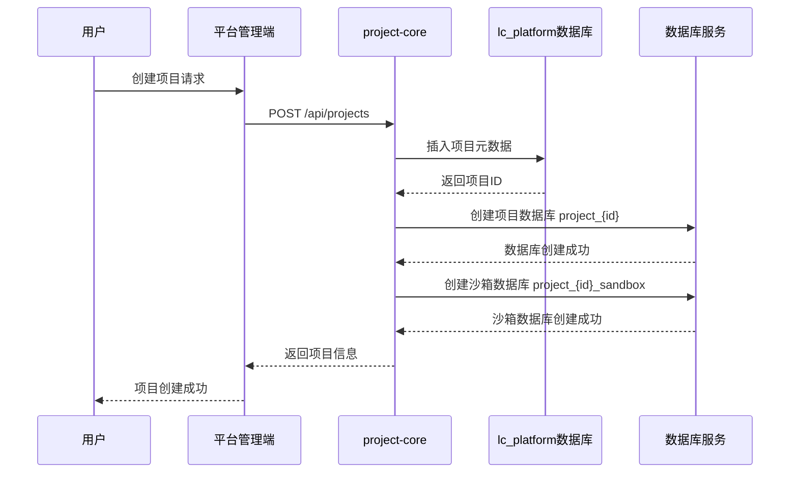
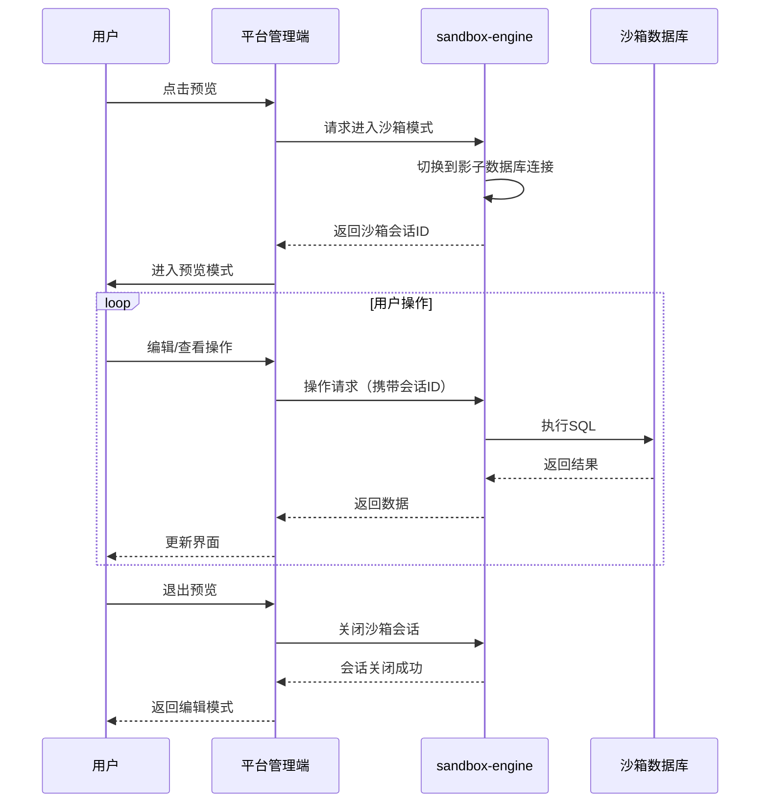
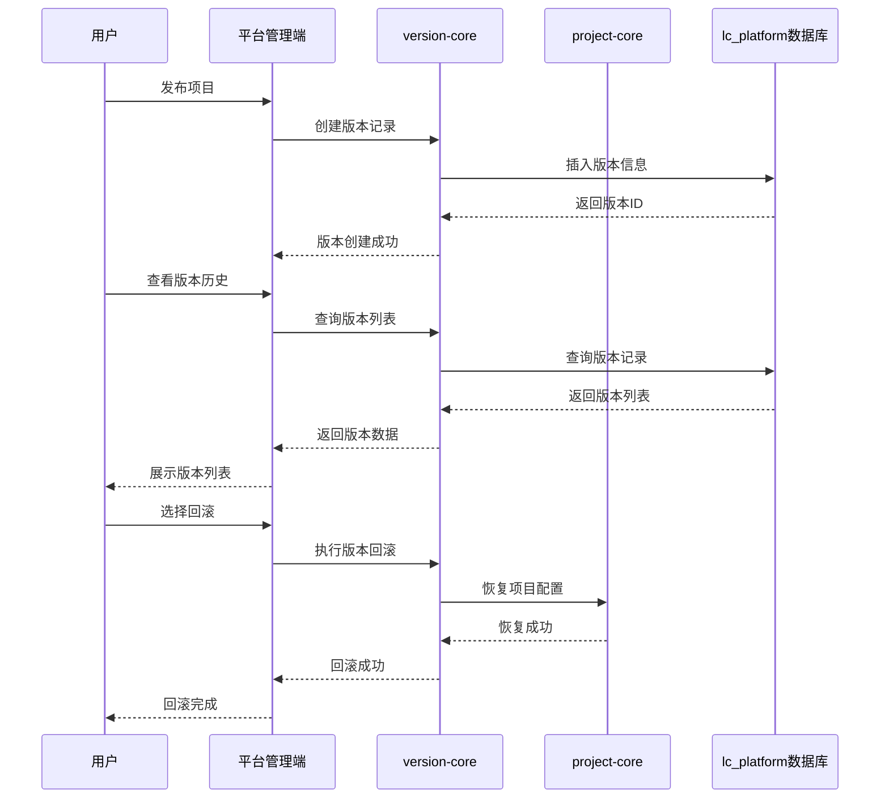
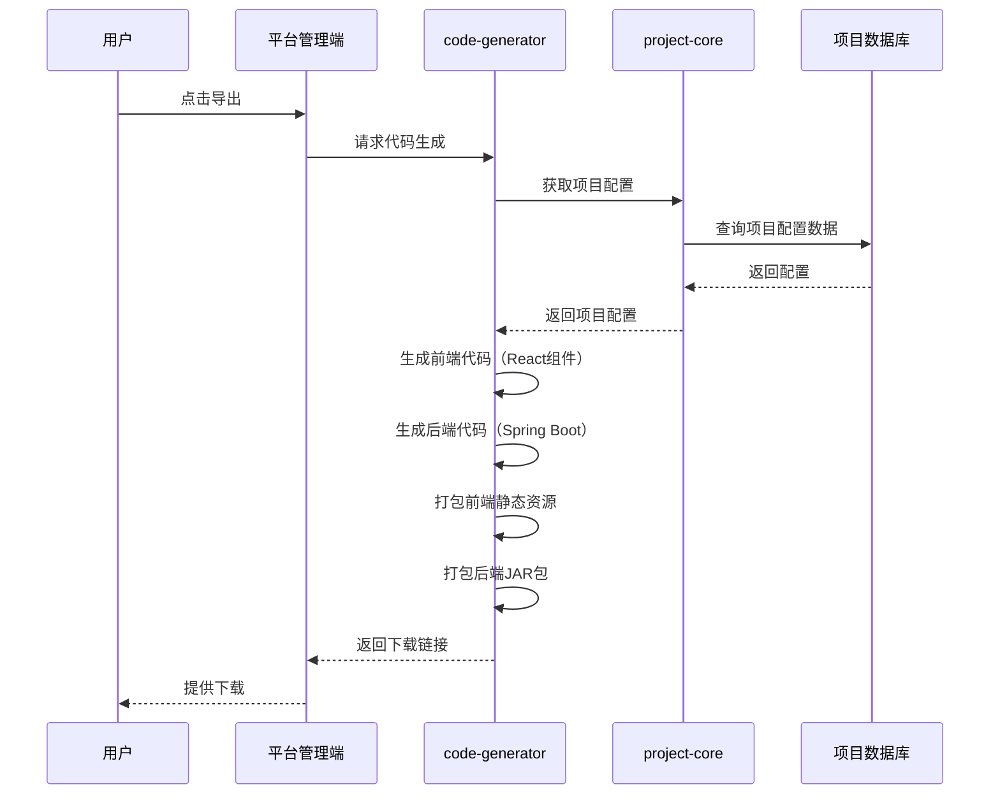
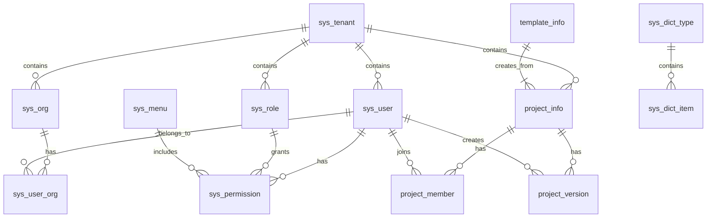
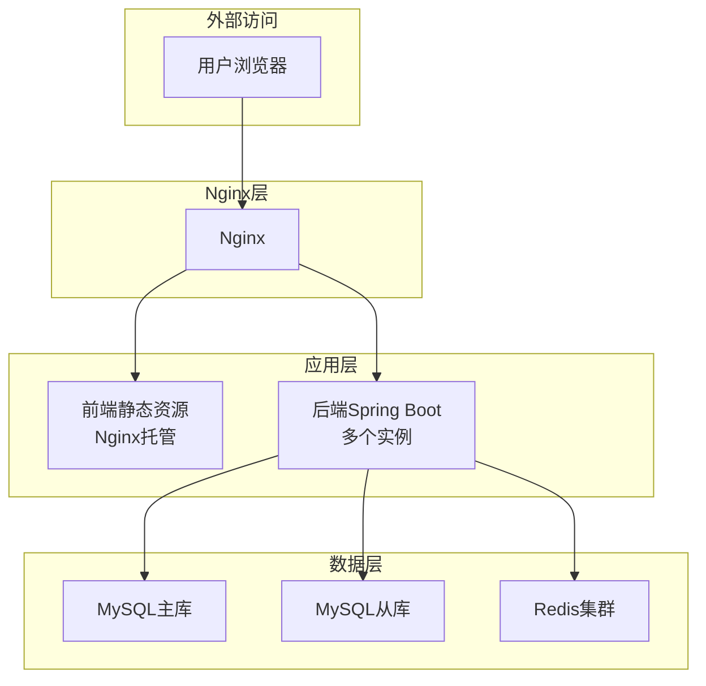
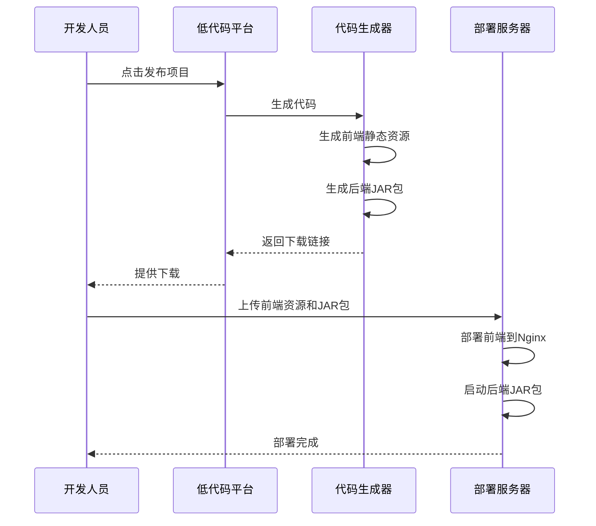

# 低代码平台详细设计文档

## 1. 概述

### 1.1 文档目的
本文档为低代码平台（偏向无代码）的详细设计文档，包含系统架构、功能模块、数据库设计、接口设计等内容，作为开发实施的依据。

### 1.2 技术栈

| 层级 | 技术 | 版本 |
|------|------|------|
| 后端框架 | Spring Boot | 3.2.x |
| 前端框架 | React | 18.x |
| 前端语言 | TypeScript | 5.x |
| UI组件库 | Ant Design Pro | 6.x |
| 构建工具 | Maven | 3.9.x |
| 前端构建 | Vite | 6.x |
| 主数据库 | MySQL | 8.0+ |
| 缓存/会话 | Redis | 7.x |
| 沙箱隔离 | 影子数据库（Shadow DB） | - |
| 发布形式 | 前端静态资源 + 后端JAR包 | - |

### 1.3 设计原则

| 原则 | 说明 |
|------|------|
| **多租户隔离** | 基础系统共享数据库，项目级独立数据库 |
| **项目隔离** | 每个项目独立数据库，完全物理隔离 |
| **沙箱预览** | 影子数据库作为预览环境，不影响主数据 |
| **插件化设计** | 业务模块采用插件化方式加载，便于扩展 |
| **版本可控** | 支持版本记录、回滚、切换 |
| **代码生成** | 支持前端静态资源生成 + 后端JAR包导出 |

---

## 2. 系统总体架构

### 2.1 架构图

```mermaid
graph TB
    subgraph 前端层
        A[低代码平台管理端<br/>React + Ant Design Pro]
        B[项目渲染引擎]
    end

    subgraph 网关层
        C[API Gateway<br/>Spring Cloud Gateway]
    end

    subgraph 后端服务层
        D[系统核心模块<br/>system-core]
        E[项目核心模块<br/>project-core]
        F[版本管理模块<br/>version-core]
        G[模板市场模块<br/>template-core]
        H[成员管理模块<br/>member-core]
        I[沙箱引擎<br/>sandbox-engine]
        J[代码生成器<br/>code-generator]
        
        subgraph 插件化业务模块
            K[数据源插件<br/>plugin-datasource]
            L[表单插件<br/>plugin-form]
            M[BI插件<br/>plugin-bi]
            N[流程插件<br/>plugin-flow]
            O[接口插件<br/>plugin-api]
        end
    end

    subgraph 数据层
        P[基础共享数据库<br/>lc_platform]
        Q[项目独立数据库<br/>project_{project_id}]
        R[沙箱数据库<br/>project_{project_id}_sandbox]
        S[Redis缓存]
    end

    A --> C
    B --> C
    C --> D
    C --> E
    C --> F
    C --> G
    C --> H
    C --> I
    C --> J
    C --> K
    C --> L
    C --> M
    C --> N
    C --> O
    
    D --> P
    E --> P
    E --> Q
    F --> P
    G --> P
    H --> P
    I --> R
    J --> Q
    
    K --> Q
    L --> Q
    M --> Q
    N --> Q
    O --> Q
    
    D --> S
    E --> S
```

### 2.2 模块职责

| 模块 | 职责说明 |
|------|----------|
| **system-core** | 租户管理、用户管理、权限管理、角色管理、菜单管理、组织管理、字典管理 |
| **project-core** | 项目CRUD、项目预览、项目导出、项目源码生成 |
| **version-core** | 版本记录、版本回滚、版本切换 |
| **template-core** | 模板管理、模板导入导出 |
| **member-core** | 成员邀请、角色分配（只读/编辑/管理员/发布者） |
| **plugin-datasource** | 数据源配置、连接管理 |
| **plugin-form** | 表单配置、表单渲染 |
| **plugin-bi** | 可视化配置、图表渲染 |
| **plugin-flow** | 流程配置、流程引擎 |
| **plugin-api** | 接口配置、数据交互 |
| **sandbox-engine** | 影子数据库管理、实时预览 |
| **code-generator** | 前端/后端代码生成、打包部署 |

### 2.3 核心流程图

#### 2.3.1 项目创建流程



#### 2.3.2 沙箱预览流程



#### 2.3.3 版本管理流程



#### 2.3.4 代码生成流程



---

## 3. 功能模块详细设计

### 3.1 系统管理模块

#### 3.1.1 租户管理

| 功能点 | 描述 |
|--------|------|
| 租户列表 | 展示所有租户，支持分页、搜索 |
| 租户创建 | 创建新租户，设置租户名称、域名、有效期 |
| 租户编辑 | 修改租户信息 |
| 租户删除 | 删除租户（级联删除相关数据） |
| 租户状态 | 启用/禁用租户 |

#### 3.1.2 用户管理

| 功能点 | 描述 |
|--------|------|
| 用户列表 | 展示租户下所有用户，支持分页、搜索 |
| 用户创建 | 创建新用户，分配角色 |
| 用户编辑 | 修改用户信息、密码重置 |
| 用户删除 | 删除用户 |
| 用户状态 | 启用/禁用用户 |

#### 3.1.3 角色管理

| 功能点 | 描述 |
|--------|------|
| 角色列表 | 展示所有角色 |
| 角色创建 | 创建角色，设置角色名称、描述 |
| 角色编辑 | 修改角色信息 |
| 角色删除 | 删除角色 |
| 角色权限配置 | 为角色分配菜单权限和操作权限 |

#### 3.1.4 菜单管理

| 功能点 | 描述 |
|--------|------|
| 菜单列表 | 树形展示所有菜单 |
| 菜单创建 | 创建新菜单，设置父级、路径、图标 |
| 菜单编辑 | 修改菜单信息 |
| 菜单删除 | 删除菜单 |
| 菜单排序 | 调整菜单顺序 |

#### 3.1.5 组织管理

| 功能点 | 描述 |
|--------|------|
| 组织架构 | 树形展示组织架构 |
| 组织创建 | 创建部门/团队 |
| 组织编辑 | 修改组织信息 |
| 组织删除 | 删除组织 |
| 成员分配 | 为组织分配成员 |

#### 3.1.6 字典管理

| 功能点 | 描述 |
|--------|------|
| 字典列表 | 展示所有字典类型 |
| 字典创建 | 创建字典类型 |
| 字典项管理 | 管理字典下的键值对 |

### 3.2 项目管理模块

#### 3.2.1 项目CRUD

| 功能点 | 描述 |
|--------|------|
| 项目列表 | 展示租户下所有项目，支持分页、搜索、筛选 |
| 项目创建 | 创建新项目，自动创建独立数据库和沙箱数据库 |
| 项目编辑 | 修改项目基本信息（名称、描述、状态） |
| 项目删除 | 删除项目（级联删除项目数据库） |
| 项目状态 | 启用/禁用项目 |

#### 3.2.2 项目预览

| 功能点 | 描述 |
|--------|------|
| 沙箱预览 | 进入沙箱模式预览项目效果 |
| 实时编辑 | 在预览模式下实时编辑 |
| 预览退出 | 退出沙箱模式，保留沙箱数据 |

#### 3.2.3 项目导出

| 功能点 | 描述 |
|--------|------|
| 代码导出 | 导出前端静态资源和后端JAR包 |
| 配置导出 | 导出项目配置文件 |
| 数据导出 | 导出项目业务数据 |

#### 3.2.4 项目源码生成

| 功能点 | 描述 |
|--------|------|
| 前端代码生成 | 生成React组件代码 |
| 后端代码生成 | 生成Spring Boot服务代码 |
| 配置文件生成 | 生成application.yml等配置文件 |

### 3.3 版本管理模块

#### 3.3.1 版本记录

| 功能点 | 描述 |
|--------|------|
| 版本列表 | 展示项目所有版本记录 |
| 版本创建 | 发布项目时自动创建版本 |
| 版本详情 | 查看版本变更内容 |

#### 3.3.2 版本回滚

| 功能点 | 描述 |
|--------|------|
| 回滚操作 | 恢复到指定版本 |
| 回滚预览 | 预览回滚效果 |
| 回滚确认 | 确认回滚操作 |

#### 3.3.3 版本切换

| 功能点 | 描述 |
|--------|------|
| 版本切换 | 临时切换到指定版本预览 |
| 切换确认 | 确认切换回当前版本 |

### 3.4 模板市场模块

#### 3.4.1 模板管理

| 功能点 | 描述 |
|--------|------|
| 模板列表 | 展示所有模板 |
| 模板创建 | 创建新模板 |
| 模板编辑 | 修改模板信息 |
| 模板删除 | 删除模板 |
| 模板状态 | 启用/禁用模板 |

#### 3.4.2 模板导入导出

| 功能点 | 描述 |
|--------|------|
| 模板导入 | 从文件导入模板 |
| 模板导出 | 将模板导出为文件 |
| 模板应用 | 将模板应用到项目 |

### 3.5 项目成员管理模块

#### 3.5.1 成员管理

| 功能点 | 描述 |
|--------|------|
| 成员列表 | 展示项目所有成员 |
| 成员邀请 | 邀请同租户下的其他成员 |
| 成员移除 | 移除项目成员 |
| 角色分配 | 分配角色（只读/编辑/管理员/发布者） |

#### 3.5.2 角色权限

| 角色 | 权限说明 |
|------|----------|
| 只读 | 只能查看项目，不能编辑 |
| 编辑 | 可以编辑项目内容，不能发布 |
| 管理员 | 完全管理权限，包括成员管理 |
| 发布者 | 可以编辑和发布项目 |

#### 3.5.3 并发冲突处理

| 机制 | 描述 |
|------|------|
| 乐观锁 | 通过版本号检测冲突 |
| 实时协作 | 基于WebSocket实现实时同步 |
| 冲突提示 | 检测到冲突时提示用户选择覆盖或合并 |

### 3.6 数据源管理插件

#### 3.6.1 数据源配置

| 功能点 | 描述 |
|--------|------|
| 数据源列表 | 展示项目所有数据源 |
| 数据源创建 | 创建新数据源（MySQL、SQLite、API等） |
| 数据源编辑 | 修改数据源配置 |
| 数据源删除 | 删除数据源 |
| 连接测试 | 测试数据源连接 |

### 3.7 表单管理插件

#### 3.7.1 表单配置

| 功能点 | 描述 |
|--------|------|
| 表单列表 | 展示项目所有表单 |
| 表单创建 | 创建新表单，拖拽式配置 |
| 表单编辑 | 编辑表单配置 |
| 表单删除 | 删除表单 |
| 表单预览 | 预览表单效果 |

#### 3.7.2 表单组件

| 组件类型 | 描述 |
|----------|------|
| 文本输入 | 单行文本输入 |
| 文本域 | 多行文本输入 |
| 数字输入 | 数字输入框 |
| 日期选择 | 日期选择器 |
| 时间选择 | 时间选择器 |
| 下拉选择 | 下拉菜单 |
| 单选框 | 单选选项 |
| 复选框 | 多选选项 |
| 文件上传 | 文件上传组件 |

### 3.8 BI管理插件

#### 3.8.1 可视化配置

| 功能点 | 描述 |
|--------|------|
| 仪表盘列表 | 展示项目所有仪表盘 |
| 仪表盘创建 | 创建新仪表盘 |
| 仪表盘编辑 | 编辑仪表盘布局 |
| 仪表盘删除 | 删除仪表盘 |

#### 3.8.2 图表组件

| 图表类型 | 描述 |
|----------|------|
| 柱状图 | 柱状数据展示 |
| 折线图 | 趋势数据展示 |
| 饼图 | 占比数据展示 |
| 环形图 | 环形占比展示 |
| 表格 | 数据表格展示 |
| 指标卡 | 关键指标展示 |

### 3.9 流程管理插件

#### 3.9.1 流程配置

| 功能点 | 描述 |
|--------|------|
| 流程列表 | 展示项目所有流程 |
| 流程创建 | 创建新流程，拖拽式配置 |
| 流程编辑 | 编辑流程配置 |
| 流程删除 | 删除流程 |
| 流程测试 | 测试流程执行 |

#### 3.9.2 流程节点

| 节点类型 | 描述 |
|----------|------|
| 开始节点 | 流程起点 |
| 结束节点 | 流程终点 |
| 审批节点 | 审批环节 |
| 条件节点 | 条件判断 |
| 并行节点 | 并行执行 |
| 子流程 | 嵌套子流程 |

### 3.10 接口管理插件

#### 3.10.1 接口配置

| 功能点 | 描述 |
|--------|------|
| 接口列表 | 展示项目所有接口 |
| 接口创建 | 创建新接口配置 |
| 接口编辑 | 编辑接口配置 |
| 接口删除 | 删除接口 |
| 接口测试 | 测试接口调用 |

#### 3.10.2 接口类型

| 类型 | 描述 |
|------|------|
| REST API | RESTful接口 |
| GraphQL | GraphQL接口 |
| WebSocket | WebSocket接口 |
| 内部服务 | 平台内部服务调用 |

---

## 4. 数据库设计

### 4.1 基础共享数据库（lc_platform）

#### 4.1.1 租户表（sys_tenant）

| 字段名 | 类型 | 约束 | 说明 |
|--------|------|------|------|
| id | BIGINT | PRIMARY KEY, AUTO_INCREMENT | 租户ID |
| tenant_code | VARCHAR(64) | UNIQUE, NOT NULL | 租户编码 |
| tenant_name | VARCHAR(128) | NOT NULL | 租户名称 |
| domain | VARCHAR(256) | NULL | 租户域名 |
| status | TINYINT | DEFAULT 1 | 状态：0-禁用，1-启用 |
| expire_time | DATETIME | NULL | 过期时间 |
| created_by | BIGINT | NOT NULL | 创建人ID |
| created_time | DATETIME | DEFAULT CURRENT_TIMESTAMP | 创建时间 |
| updated_by | BIGINT | NULL | 更新人ID |
| updated_time | DATETIME | ON UPDATE CURRENT_TIMESTAMP | 更新时间 |

#### 4.1.2 用户表（sys_user）

| 字段名 | 类型 | 约束 | 说明 |
|--------|------|------|------|
| id | BIGINT | PRIMARY KEY, AUTO_INCREMENT | 用户ID |
| tenant_id | BIGINT | NOT NULL, FOREIGN KEY | 租户ID |
| username | VARCHAR(64) | UNIQUE, NOT NULL | 用户名 |
| password | VARCHAR(256) | NOT NULL | 密码（加密） |
| real_name | VARCHAR(64) | NULL | 真实姓名 |
| email | VARCHAR(128) | NULL | 邮箱 |
| phone | VARCHAR(32) | NULL | 手机号 |
| avatar | VARCHAR(512) | NULL | 头像地址 |
| status | TINYINT | DEFAULT 1 | 状态：0-禁用，1-启用 |
| created_by | BIGINT | NOT NULL | 创建人ID |
| created_time | DATETIME | DEFAULT CURRENT_TIMESTAMP | 创建时间 |
| updated_by | BIGINT | NULL | 更新人ID |
| updated_time | DATETIME | ON UPDATE CURRENT_TIMESTAMP | 更新时间 |

#### 4.1.3 角色表（sys_role）

| 字段名 | 类型 | 约束 | 说明 |
|--------|------|------|------|
| id | BIGINT | PRIMARY KEY, AUTO_INCREMENT | 角色ID |
| tenant_id | BIGINT | NOT NULL, FOREIGN KEY | 租户ID |
| role_code | VARCHAR(64) | UNIQUE, NOT NULL | 角色编码 |
| role_name | VARCHAR(128) | NOT NULL | 角色名称 |
| description | VARCHAR(512) | NULL | 角色描述 |
| status | TINYINT | DEFAULT 1 | 状态：0-禁用，1-启用 |
| created_by | BIGINT | NOT NULL | 创建人ID |
| created_time | DATETIME | DEFAULT CURRENT_TIMESTAMP | 创建时间 |
| updated_by | BIGINT | NULL | 更新人ID |
| updated_time | DATETIME | ON UPDATE CURRENT_TIMESTAMP | 更新时间 |

#### 4.1.4 菜单表（sys_menu）

| 字段名 | 类型 | 约束 | 说明 |
|--------|------|------|------|
| id | BIGINT | PRIMARY KEY, AUTO_INCREMENT | 菜单ID |
| parent_id | BIGINT | DEFAULT 0 | 父菜单ID |
| menu_name | VARCHAR(128) | NOT NULL | 菜单名称 |
| path | VARCHAR(256) | NULL | 路由路径 |
| component | VARCHAR(256) | NULL | 组件路径 |
| icon | VARCHAR(64) | NULL | 图标 |
| sort_order | INT | DEFAULT 0 | 排序号 |
| menu_type | TINYINT | NOT NULL | 类型：0-目录，1-菜单，2-按钮 |
| status | TINYINT | DEFAULT 1 | 状态：0-禁用，1-启用 |
| created_by | BIGINT | NOT NULL | 创建人ID |
| created_time | DATETIME | DEFAULT CURRENT_TIMESTAMP | 创建时间 |
| updated_by | BIGINT | NULL | 更新人ID |
| updated_time | DATETIME | ON UPDATE CURRENT_TIMESTAMP | 更新时间 |

#### 4.1.5 权限表（sys_permission）

| 字段名 | 类型 | 约束 | 说明 |
|--------|------|------|------|
| id | BIGINT | PRIMARY KEY, AUTO_INCREMENT | 权限ID |
| role_id | BIGINT | NOT NULL, FOREIGN KEY | 角色ID |
| menu_id | BIGINT | NOT NULL, FOREIGN KEY | 菜单ID |
| permissions | VARCHAR(512) | NULL | 操作权限（逗号分隔） |
| created_time | DATETIME | DEFAULT CURRENT_TIMESTAMP | 创建时间 |

#### 4.1.6 组织表（sys_org）

| 字段名 | 类型 | 约束 | 说明 |
|--------|------|------|------|
| id | BIGINT | PRIMARY KEY, AUTO_INCREMENT | 组织ID |
| tenant_id | BIGINT | NOT NULL, FOREIGN KEY | 租户ID |
| parent_id | BIGINT | DEFAULT 0 | 父组织ID |
| org_name | VARCHAR(128) | NOT NULL | 组织名称 |
| org_code | VARCHAR(64) | UNIQUE | 组织编码 |
| org_type | TINYINT | DEFAULT 1 | 类型：1-部门，2-团队 |
| sort_order | INT | DEFAULT 0 | 排序号 |
| created_by | BIGINT | NOT NULL | 创建人ID |
| created_time | DATETIME | DEFAULT CURRENT_TIMESTAMP | 创建时间 |
| updated_by | BIGINT | NULL | 更新人ID |
| updated_time | DATETIME | ON UPDATE CURRENT_TIMESTAMP | 更新时间 |

#### 4.1.7 用户组织关联表（sys_user_org）

| 字段名 | 类型 | 约束 | 说明 |
|--------|------|------|------|
| id | BIGINT | PRIMARY KEY, AUTO_INCREMENT | ID |
| user_id | BIGINT | NOT NULL, FOREIGN KEY | 用户ID |
| org_id | BIGINT | NOT NULL, FOREIGN KEY | 组织ID |
| created_time | DATETIME | DEFAULT CURRENT_TIMESTAMP | 创建时间 |

#### 4.1.8 字典类型表（sys_dict_type）

| 字段名 | 类型 | 约束 | 说明 |
|--------|------|------|------|
| id | BIGINT | PRIMARY KEY, AUTO_INCREMENT | ID |
| dict_code | VARCHAR(64) | UNIQUE, NOT NULL | 字典编码 |
| dict_name | VARCHAR(128) | NOT NULL | 字典名称 |
| description | VARCHAR(512) | NULL | 描述 |
| status | TINYINT | DEFAULT 1 | 状态：0-禁用，1-启用 |
| created_by | BIGINT | NOT NULL | 创建人ID |
| created_time | DATETIME | DEFAULT CURRENT_TIMESTAMP | 创建时间 |
| updated_by | BIGINT | NULL | 更新人ID |
| updated_time | DATETIME | ON UPDATE CURRENT_TIMESTAMP | 更新时间 |

#### 4.1.9 字典项表（sys_dict_item）

| 字段名 | 类型 | 约束 | 说明 |
|--------|------|------|------|
| id | BIGINT | PRIMARY KEY, AUTO_INCREMENT | ID |
| dict_type_id | BIGINT | NOT NULL, FOREIGN KEY | 字典类型ID |
| item_key | VARCHAR(64) | NOT NULL | 字典键 |
| item_value | VARCHAR(256) | NOT NULL | 字典值 |
| sort_order | INT | DEFAULT 0 | 排序号 |
| status | TINYINT | DEFAULT 1 | 状态：0-禁用，1-启用 |
| created_time | DATETIME | DEFAULT CURRENT_TIMESTAMP | 创建时间 |

#### 4.1.10 项目信息表（project_info）

| 字段名 | 类型 | 约束 | 说明 |
|--------|------|------|------|
| id | BIGINT | PRIMARY KEY, AUTO_INCREMENT | 项目ID |
| tenant_id | BIGINT | NOT NULL, FOREIGN KEY | 租户ID |
| project_name | VARCHAR(128) | NOT NULL | 项目名称 |
| project_code | VARCHAR(64) | UNIQUE, NOT NULL | 项目编码 |
| description | VARCHAR(1024) | NULL | 项目描述 |
| db_name | VARCHAR(128) | NOT NULL | 数据库名称 |
| status | TINYINT | DEFAULT 1 | 状态：0-禁用，1-启用 |
| created_by | BIGINT | NOT NULL | 创建人ID |
| created_time | DATETIME | DEFAULT CURRENT_TIMESTAMP | 创建时间 |
| updated_by | BIGINT | NULL | 更新人ID |
| updated_time | DATETIME | ON UPDATE CURRENT_TIMESTAMP | 更新时间 |

#### 4.1.11 项目成员表（project_member）

| 字段名 | 类型 | 约束 | 说明 |
|--------|------|------|------|
| id | BIGINT | PRIMARY KEY, AUTO_INCREMENT | ID |
| project_id | BIGINT | NOT NULL, FOREIGN KEY | 项目ID |
| user_id | BIGINT | NOT NULL, FOREIGN KEY | 用户ID |
| role | VARCHAR(32) | NOT NULL | 角色：viewer/editor/admin/publisher |
| status | TINYINT | DEFAULT 1 | 状态：0-禁用，1-启用 |
| created_by | BIGINT | NOT NULL | 创建人ID |
| created_time | DATETIME | DEFAULT CURRENT_TIMESTAMP | 创建时间 |
| updated_by | BIGINT | NULL | 更新人ID |
| updated_time | DATETIME | ON UPDATE CURRENT_TIMESTAMP | 更新时间 |

#### 4.1.12 项目版本表（project_version）

| 字段名 | 类型 | 约束 | 说明 |
|--------|------|------|------|
| id | BIGINT | PRIMARY KEY, AUTO_INCREMENT | 版本ID |
| project_id | BIGINT | NOT NULL, FOREIGN KEY | 项目ID |
| version_number | VARCHAR(64) | NOT NULL | 版本号 |
| version_name | VARCHAR(128) | NULL | 版本名称 |
| changelog | TEXT | NULL | 变更日志 |
| created_by | BIGINT | NOT NULL | 创建人ID |
| created_time | DATETIME | DEFAULT CURRENT_TIMESTAMP | 创建时间 |

#### 4.1.13 模板信息表（template_info）

| 字段名 | 类型 | 约束 | 说明 |
|--------|------|------|------|
| id | BIGINT | PRIMARY KEY, AUTO_INCREMENT | 模板ID |
| tenant_id | BIGINT | NULL | 租户ID（NULL表示公共模板） |
| template_name | VARCHAR(128) | NOT NULL | 模板名称 |
| template_code | VARCHAR(64) | UNIQUE, NOT NULL | 模板编码 |
| description | VARCHAR(1024) | NULL | 模板描述 |
| thumbnail | VARCHAR(512) | NULL | 缩略图地址 |
| status | TINYINT | DEFAULT 1 | 状态：0-禁用，1-启用 |
| created_by | BIGINT | NOT NULL | 创建人ID |
| created_time | DATETIME | DEFAULT CURRENT_TIMESTAMP | 创建时间 |
| updated_by | BIGINT | NULL | 更新人ID |
| updated_time | DATETIME | ON UPDATE CURRENT_TIMESTAMP | 更新时间 |

### 4.2 项目独立数据库（project_{project_id}）

#### 4.2.1 数据源配置表（ds_datasource）

| 字段名 | 类型 | 约束 | 说明 |
|--------|------|------|------|
| id | BIGINT | PRIMARY KEY, AUTO_INCREMENT | ID |
| datasource_name | VARCHAR(128) | NOT NULL | 数据源名称 |
| datasource_type | VARCHAR(32) | NOT NULL | 类型：mysql/sqlite/api |
| connection_params | TEXT | NULL | 连接参数（JSON） |
| status | TINYINT | DEFAULT 1 | 状态：0-禁用，1-启用 |
| created_by | BIGINT | NOT NULL | 创建人ID |
| created_time | DATETIME | DEFAULT CURRENT_TIMESTAMP | 创建时间 |
| updated_by | BIGINT | NULL | 更新人ID |
| updated_time | DATETIME | ON UPDATE CURRENT_TIMESTAMP | 更新时间 |

#### 4.2.2 表单配置表（form_form）

| 字段名 | 类型 | 约束 | 说明 |
|--------|------|------|------|
| id | BIGINT | PRIMARY KEY, AUTO_INCREMENT | ID |
| form_name | VARCHAR(128) | NOT NULL | 表单名称 |
| form_code | VARCHAR(64) | UNIQUE, NOT NULL | 表单编码 |
| form_config | TEXT | NULL | 表单配置（JSON） |
| status | TINYINT | DEFAULT 1 | 状态：0-禁用，1-启用 |
| created_by | BIGINT | NOT NULL | 创建人ID |
| created_time | DATETIME | DEFAULT CURRENT_TIMESTAMP | 创建时间 |
| updated_by | BIGINT | NULL | 更新人ID |
| updated_time | DATETIME | ON UPDATE CURRENT_TIMESTAMP | 更新时间 |

#### 4.2.3 表单字段表（form_field）

| 字段名 | 类型 | 约束 | 说明 |
|--------|------|------|------|
| id | BIGINT | PRIMARY KEY, AUTO_INCREMENT | ID |
| form_id | BIGINT | NOT NULL, FOREIGN KEY | 表单ID |
| field_name | VARCHAR(128) | NOT NULL | 字段名称 |
| field_code | VARCHAR(64) | NOT NULL | 字段编码 |
| field_type | VARCHAR(32) | NOT NULL | 字段类型 |
| field_config | TEXT | NULL | 字段配置（JSON） |
| sort_order | INT | DEFAULT 0 | 排序号 |
| required | TINYINT | DEFAULT 0 | 是否必填 |
| created_by | BIGINT | NOT NULL | 创建人ID |
| created_time | DATETIME | DEFAULT CURRENT_TIMESTAMP | 创建时间 |
| updated_by | BIGINT | NULL | 更新人ID |
| updated_time | DATETIME | ON UPDATE CURRENT_TIMESTAMP | 更新时间 |

#### 4.2.4 BI仪表盘表（bi_dashboard）

| 字段名 | 类型 | 约束 | 说明 |
|--------|------|------|------|
| id | BIGINT | PRIMARY KEY, AUTO_INCREMENT | ID |
| dashboard_name | VARCHAR(128) | NOT NULL | 仪表盘名称 |
| dashboard_code | VARCHAR(64) | UNIQUE, NOT NULL | 仪表盘编码 |
| layout_config | TEXT | NULL | 布局配置（JSON） |
| status | TINYINT | DEFAULT 1 | 状态：0-禁用，1-启用 |
| created_by | BIGINT | NOT NULL | 创建人ID |
| created_time | DATETIME | DEFAULT CURRENT_TIMESTAMP | 创建时间 |
| updated_by | BIGINT | NULL | 更新人ID |
| updated_time | DATETIME | ON UPDATE CURRENT_TIMESTAMP | 更新时间 |

#### 4.2.5 BI图表表（bi_chart）

| 字段名 | 类型 | 约束 | 说明 |
|--------|------|------|------|
| id | BIGINT | PRIMARY KEY, AUTO_INCREMENT | ID |
| dashboard_id | BIGINT | NOT NULL, FOREIGN KEY | 仪表盘ID |
| chart_name | VARCHAR(128) | NOT NULL | 图表名称 |
| chart_type | VARCHAR(32) | NOT NULL | 图表类型 |
| chart_config | TEXT | NULL | 图表配置（JSON） |
| x | INT | DEFAULT 0 | X坐标 |
| y | INT | DEFAULT 0 | Y坐标 |
| width | INT | DEFAULT 4 | 宽度 |
| height | INT | DEFAULT 3 | 高度 |
| created_by | BIGINT | NOT NULL | 创建人ID |
| created_time | DATETIME | DEFAULT CURRENT_TIMESTAMP | 创建时间 |
| updated_by | BIGINT | NULL | 更新人ID |
| updated_time | DATETIME | ON UPDATE CURRENT_TIMESTAMP | 更新时间 |

#### 4.2.6 流程定义表（flow_definition）

| 字段名 | 类型 | 约束 | 说明 |
|--------|------|------|------|
| id | BIGINT | PRIMARY KEY, AUTO_INCREMENT | ID |
| flow_name | VARCHAR(128) | NOT NULL | 流程名称 |
| flow_code | VARCHAR(64) | UNIQUE, NOT NULL | 流程编码 |
| flow_config | TEXT | NULL | 流程配置（JSON） |
| status | TINYINT | DEFAULT 1 | 状态：0-禁用，1-启用 |
| created_by | BIGINT | NOT NULL | 创建人ID |
| created_time | DATETIME | DEFAULT CURRENT_TIMESTAMP | 创建时间 |
| updated_by | BIGINT | NULL | 更新人ID |
| updated_time | DATETIME | ON UPDATE CURRENT_TIMESTAMP | 更新时间 |

#### 4.2.7 流程实例表（flow_instance）

| 字段名 | 类型 | 约束 | 说明 |
|--------|------|------|------|
| id | BIGINT | PRIMARY KEY, AUTO_INCREMENT | ID |
| flow_definition_id | BIGINT | NOT NULL, FOREIGN KEY | 流程定义ID |
| instance_status | VARCHAR(32) | NOT NULL | 实例状态 |
| current_node_id | BIGINT | NULL | 当前节点ID |
| variables | TEXT | NULL | 流程变量（JSON） |
| created_by | BIGINT | NOT NULL | 创建人ID |
| created_time | DATETIME | DEFAULT CURRENT_TIMESTAMP | 创建时间 |
| completed_time | DATETIME | NULL | 完成时间 |

#### 4.2.8 接口配置表（api_config）

| 字段名 | 类型 | 约束 | 说明 |
|--------|------|------|------|
| id | BIGINT | PRIMARY KEY, AUTO_INCREMENT | ID |
| api_name | VARCHAR(128) | NOT NULL | 接口名称 |
| api_code | VARCHAR(64) | UNIQUE, NOT NULL | 接口编码 |
| api_type | VARCHAR(32) | NOT NULL | 接口类型 |
| request_method | VARCHAR(16) | NOT NULL | 请求方法 |
| request_url | VARCHAR(512) | NOT NULL | 请求URL |
| request_params | TEXT | NULL | 请求参数（JSON） |
| response_config | TEXT | NULL | 响应配置（JSON） |
| status | TINYINT | DEFAULT 1 | 状态：0-禁用，1-启用 |
| created_by | BIGINT | NOT NULL | 创建人ID |
| created_time | DATETIME | DEFAULT CURRENT_TIMESTAMP | 创建时间 |
| updated_by | BIGINT | NULL | 更新人ID |
| updated_time | DATETIME | ON UPDATE CURRENT_TIMESTAMP | 更新时间 |

### 4.3 ER图



---

## 5. 接口设计

### 5.1 系统管理接口

#### 5.1.1 租户管理

| API路径 | HTTP方法 | 所属模块 | 说明 |
|---------|----------|----------|------|
| /api/system/tenants | GET | system-core | 获取租户列表 |
| /api/system/tenants/{id} | GET | system-core | 获取租户详情 |
| /api/system/tenants | POST | system-core | 创建租户 |
| /api/system/tenants/{id} | PUT | system-core | 更新租户 |
| /api/system/tenants/{id} | DELETE | system-core | 删除租户 |
| /api/system/tenants/{id}/status | PATCH | system-core | 更新租户状态 |

#### 5.1.2 用户管理

| API路径 | HTTP方法 | 所属模块 | 说明 |
|---------|----------|----------|------|
| /api/system/users | GET | system-core | 获取用户列表 |
| /api/system/users/{id} | GET | system-core | 获取用户详情 |
| /api/system/users | POST | system-core | 创建用户 |
| /api/system/users/{id} | PUT | system-core | 更新用户 |
| /api/system/users/{id} | DELETE | system-core | 删除用户 |
| /api/system/users/{id}/status | PATCH | system-core | 更新用户状态 |
| /api/system/users/{id}/password | PUT | system-core | 重置密码 |

#### 5.1.3 角色管理

| API路径 | HTTP方法 | 所属模块 | 说明 |
|---------|----------|----------|------|
| /api/system/roles | GET | system-core | 获取角色列表 |
| /api/system/roles/{id} | GET | system-core | 获取角色详情 |
| /api/system/roles | POST | system-core | 创建角色 |
| /api/system/roles/{id} | PUT | system-core | 更新角色 |
| /api/system/roles/{id} | DELETE | system-core | 删除角色 |
| /api/system/roles/{id}/permissions | PUT | system-core | 配置角色权限 |

#### 5.1.4 菜单管理

| API路径 | HTTP方法 | 所属模块 | 说明 |
|---------|----------|----------|------|
| /api/system/menus | GET | system-core | 获取菜单列表 |
| /api/system/menus/{id} | GET | system-core | 获取菜单详情 |
| /api/system/menus | POST | system-core | 创建菜单 |
| /api/system/menus/{id} | PUT | system-core | 更新菜单 |
| /api/system/menus/{id} | DELETE | system-core | 删除菜单 |

#### 5.1.5 组织管理

| API路径 | HTTP方法 | 所属模块 | 说明 |
|---------|----------|----------|------|
| /api/system/orgs | GET | system-core | 获取组织列表 |
| /api/system/orgs/{id} | GET | system-core | 获取组织详情 |
| /api/system/orgs | POST | system-core | 创建组织 |
| /api/system/orgs/{id} | PUT | system-core | 更新组织 |
| /api/system/orgs/{id} | DELETE | system-core | 删除组织 |
| /api/system/orgs/{id}/members | POST | system-core | 分配成员 |

#### 5.1.6 字典管理

| API路径 | HTTP方法 | 所属模块 | 说明 |
|---------|----------|----------|------|
| /api/system/dict-types | GET | system-core | 获取字典类型列表 |
| /api/system/dict-types/{id} | GET | system-core | 获取字典类型详情 |
| /api/system/dict-types | POST | system-core | 创建字典类型 |
| /api/system/dict-types/{id} | PUT | system-core | 更新字典类型 |
| /api/system/dict-types/{id} | DELETE | system-core | 删除字典类型 |
| /api/system/dict-types/{id}/items | GET | system-core | 获取字典项列表 |
| /api/system/dict-types/{id}/items | POST | system-core | 创建字典项 |
| /api/system/dict-types/{id}/items/{itemId} | PUT | system-core | 更新字典项 |
| /api/system/dict-types/{id}/items/{itemId} | DELETE | system-core | 删除字典项 |

### 5.2 项目管理接口

#### 5.2.1 项目CRUD

| API路径 | HTTP方法 | 所属模块 | 说明 |
|---------|----------|----------|------|
| /api/projects | GET | project-core | 获取项目列表 |
| /api/projects/{id} | GET | project-core | 获取项目详情 |
| /api/projects | POST | project-core | 创建项目 |
| /api/projects/{id} | PUT | project-core | 更新项目 |
| /api/projects/{id} | DELETE | project-core | 删除项目 |
| /api/projects/{id}/status | PATCH | project-core | 更新项目状态 |

#### 5.2.2 项目预览

| API路径 | HTTP方法 | 所属模块 | 说明 |
|---------|----------|----------|------|
| /api/projects/{id}/preview | POST | sandbox-engine | 进入预览模式 |
| /api/projects/{id}/preview/exit | POST | sandbox-engine | 退出预览模式 |
| /api/projects/{id}/preview/data | GET | sandbox-engine | 获取预览数据 |
| /api/projects/{id}/preview/data | POST | sandbox-engine | 提交预览数据 |

#### 5.2.3 项目导出

| API路径 | HTTP方法 | 所属模块 | 说明 |
|---------|----------|----------|------|
| /api/projects/{id}/export/code | POST | code-generator | 导出代码 |
| /api/projects/{id}/export/config | POST | project-core | 导出配置 |
| /api/projects/{id}/export/data | POST | project-core | 导出数据 |

### 5.3 版本管理接口

| API路径 | HTTP方法 | 所属模块 | 说明 |
|---------|----------|----------|------|
| /api/projects/{id}/versions | GET | version-core | 获取版本列表 |
| /api/projects/{id}/versions/{versionId} | GET | version-core | 获取版本详情 |
| /api/projects/{id}/versions | POST | version-core | 创建版本 |
| /api/projects/{id}/versions/{versionId}/rollback | POST | version-core | 版本回滚 |
| /api/projects/{id}/versions/{versionId}/switch | POST | version-core | 切换版本 |

### 5.4 模板市场接口

| API路径 | HTTP方法 | 所属模块 | 说明 |
|---------|----------|----------|------|
| /api/templates | GET | template-core | 获取模板列表 |
| /api/templates/{id} | GET | template-core | 获取模板详情 |
| /api/templates | POST | template-core | 创建模板 |
| /api/templates/{id} | PUT | template-core | 更新模板 |
| /api/templates/{id} | DELETE | template-core | 删除模板 |
| /api/templates/{id}/apply | POST | template-core | 应用模板到项目 |

### 5.5 项目成员接口

| API路径 | HTTP方法 | 所属模块 | 说明 |
|---------|----------|----------|------|
| /api/projects/{id}/members | GET | member-core | 获取成员列表 |
| /api/projects/{id}/members | POST | member-core | 邀请成员 |
| /api/projects/{id}/members/{memberId} | PUT | member-core | 更新成员角色 |
| /api/projects/{id}/members/{memberId} | DELETE | member-core | 移除成员 |

### 5.6 数据源接口

| API路径 | HTTP方法 | 所属模块 | 说明 |
|---------|----------|----------|------|
| /api/projects/{id}/datasources | GET | plugin-datasource | 获取数据源列表 |
| /api/projects/{id}/datasources/{id} | GET | plugin-datasource | 获取数据源详情 |
| /api/projects/{id}/datasources | POST | plugin-datasource | 创建数据源 |
| /api/projects/{id}/datasources/{id} | PUT | plugin-datasource | 更新数据源 |
| /api/projects/{id}/datasources/{id} | DELETE | plugin-datasource | 删除数据源 |
| /api/projects/{id}/datasources/{id}/test | POST | plugin-datasource | 测试连接 |

### 5.7 表单接口

| API路径 | HTTP方法 | 所属模块 | 说明 |
|---------|----------|----------|------|
| /api/projects/{id}/forms | GET | plugin-form | 获取表单列表 |
| /api/projects/{id}/forms/{id} | GET | plugin-form | 获取表单详情 |
| /api/projects/{id}/forms | POST | plugin-form | 创建表单 |
| /api/projects/{id}/forms/{id} | PUT | plugin-form | 更新表单 |
| /api/projects/{id}/forms/{id} | DELETE | plugin-form | 删除表单 |
| /api/projects/{id}/forms/{id}/preview | GET | plugin-form | 预览表单 |

### 5.8 BI接口

| API路径 | HTTP方法 | 所属模块 | 说明 |
|---------|----------|----------|------|
| /api/projects/{id}/dashboards | GET | plugin-bi | 获取仪表盘列表 |
| /api/projects/{id}/dashboards/{id} | GET | plugin-bi | 获取仪表盘详情 |
| /api/projects/{id}/dashboards | POST | plugin-bi | 创建仪表盘 |
| /api/projects/{id}/dashboards/{id} | PUT | plugin-bi | 更新仪表盘 |
| /api/projects/{id}/dashboards/{id} | DELETE | plugin-bi | 删除仪表盘 |

### 5.9 流程接口

| API路径 | HTTP方法 | 所属模块 | 说明 |
|---------|----------|----------|------|
| /api/projects/{id}/flows | GET | plugin-flow | 获取流程列表 |
| /api/projects/{id}/flows/{id} | GET | plugin-flow | 获取流程详情 |
| /api/projects/{id}/flows | POST | plugin-flow | 创建流程 |
| /api/projects/{id}/flows/{id} | PUT | plugin-flow | 更新流程 |
| /api/projects/{id}/flows/{id} | DELETE | plugin-flow | 删除流程 |
| /api/projects/{id}/flows/{id}/instances | POST | plugin-flow | 启动流程实例 |

### 5.10 接口管理接口

| API路径 | HTTP方法 | 所属模块 | 说明 |
|---------|----------|----------|------|
| /api/projects/{id}/apis | GET | plugin-api | 获取接口列表 |
| /api/projects/{id}/apis/{id} | GET | plugin-api | 获取接口详情 |
| /api/projects/{id}/apis | POST | plugin-api | 创建接口 |
| /api/projects/{id}/apis/{id} | PUT | plugin-api | 更新接口 |
| /api/projects/{id}/apis/{id} | DELETE | plugin-api | 删除接口 |
| /api/projects/{id}/apis/{id}/test | POST | plugin-api | 测试接口 |

---

## 6. 安全设计

### 6.1 认证机制

| 机制 | 说明 |
|------|------|
| JWT Token | 用户认证使用JWT令牌 |
| Refresh Token | 支持令牌刷新 |
| Session管理 | Redis存储会话信息 |

### 6.2 授权机制

| 机制 | 说明 |
|------|------|
| RBAC权限模型 | 基于角色的访问控制 |
| 租户隔离 | 数据按租户隔离 |
| 项目隔离 | 项目级数据隔离 |
| 细粒度权限 | 支持按钮级权限控制 |

### 6.3 数据安全

| 机制 | 说明 |
|------|------|
| 密码加密 | BCrypt加密存储 |
| 传输加密 | HTTPS传输 |
| SQL注入防护 | 使用预编译语句 |
| XSS防护 | 前端输入过滤 |

---

## 7. 部署设计

### 7.1 部署架构



### 7.2 发布流程



---

## 8. 扩展性功能设计

### 8.1 可选组件

| 组件 | 说明 | 是否必选 |
|------|------|----------|
| Spring Cloud Gateway | API网关 | 否 |
| Elasticsearch | 全文搜索 | 否 |
| RabbitMQ | 消息队列 | 否 |
| MinIO | 对象存储 | 否 |

### 8.2 预留扩展点

| 扩展点 | 说明 |
|--------|------|
| 插件系统 | 支持自定义插件开发 |
| 数据源扩展 | 支持自定义数据源类型 |
| 组件扩展 | 支持自定义表单/图表组件 |
| 部署扩展 | 支持自定义部署方式 |

---

## 9. 需求追踪矩阵

| 需求点 | 对应章节 | 对应模块 |
|--------|----------|----------|
| 多租户模式 | 2.1, 4.1 | system-core |
| 租户管理 | 3.1.1 | system-core |
| 权限管理 | 3.1.3, 6.2 | system-core |
| 角色管理 | 3.1.3 | system-core |
| 菜单管理 | 3.1.4 | system-core |
| 组织管理 | 3.1.5 | system-core |
| 字典管理 | 3.1.6 | system-core |
| 项目新建 | 3.2.1 | project-core |
| 项目编辑 | 3.2.1 | project-core |
| 项目预览 | 3.2.2 | sandbox-engine |
| 项目导出 | 3.2.3 | code-generator |
| 项目源码生成 | 3.2.4 | code-generator |
| 项目数据库隔离 | 4.2 | project-core |
| 版本管理 | 3.3 | version-core |
| 版本回滚 | 3.3.2 | version-core |
| 版本切换 | 3.3.3 | version-core |
| 模板市场 | 3.4 | template-core |
| 项目成员管理 | 3.5 | member-core |
| 成员角色分配 | 3.5.2 | member-core |
| 并发冲突处理 | 3.5.3 | member-core |
| 数据源管理 | 3.6 | plugin-datasource |
| 表单管理 | 3.7 | plugin-form |
| BI管理 | 3.8 | plugin-bi |
| 流程管理 | 3.9 | plugin-flow |
| 接口管理 | 3.10 | plugin-api |
| 沙箱隔离 | 2.3.2 | sandbox-engine |
| 影子数据库 | 2.3.2 | sandbox-engine |
| 代码发布 | 7.2 | code-generator |

---

## 10. 行动优先级清单

### Phase 1 - 基础设施层（P0 - 最高优先级）

| 序号 | 任务 | 说明 | 预估时间 |
|------|------|------|----------|
| 1 | 项目脚手架搭建 | Spring Boot + React项目初始化 | 2天 |
| 2 | 基础数据库初始化 | 创建lc_platform数据库及核心表 | 1天 |
| 3 | Redis配置 | 缓存、会话管理配置 | 0.5天 |
| 4 | 多租户框架搭建 | 租户上下文、数据源路由 | 3天 |
| 5 | 用户认证体系 | JWT认证、登录登出 | 2天 |
| 6 | 权限体系搭建 | RBAC权限模型、菜单权限 | 3天 |

### Phase 2 - 项目核心模块（P1 - 高优先级）

| 序号 | 任务 | 说明 | 预估时间 |
|------|------|------|----------|
| 7 | 项目CRUD功能 | 项目创建、编辑、删除、列表 | 3天 |
| 8 | 项目数据库自动创建 | 创建项目时自动创建独立数据库 | 2天 |
| 9 | 沙箱引擎搭建 | 影子数据库管理、连接切换 | 3天 |
| 10 | 项目预览功能 | 沙箱模式预览、实时编辑 | 4天 |
| 11 | 项目成员管理 | 成员邀请、角色分配 | 2天 |
| 12 | 并发冲突处理 | 乐观锁、实时协作 | 3天 |

### Phase 3 - 版本与发布模块（P2 - 中优先级）

| 序号 | 任务 | 说明 | 预估时间 |
|------|------|------|----------|
| 13 | 版本管理功能 | 版本记录、列表、详情 | 2天 |
| 14 | 版本回滚功能 | 恢复到指定版本 | 3天 |
| 15 | 版本切换功能 | 临时切换版本预览 | 2天 |
| 16 | 前端代码生成器 | 生成React组件代码 | 5天 |
| 17 | 后端代码生成器 | 生成Spring Boot代码 | 5天 |
| 18 | 代码打包导出 | 静态资源打包、JAR包导出 | 2天 |
| 19 | 模板市场 | 模板管理、导入导出 | 3天 |

### Phase 4 - 插件化业务模块（P3 - 低优先级）

| 序号 | 任务 | 说明 | 预估时间 |
|------|------|------|----------|
| 20 | 数据源插件 | 数据源配置、连接管理 | 4天 |
| 21 | 表单插件 | 表单配置、组件库 | 6天 |
| 22 | BI插件 | 可视化配置、图表渲染 | 6天 |
| 23 | 流程插件 | 流程配置、流程引擎 | 8天 |
| 24 | 接口插件 | 接口配置、数据交互 | 4天 |

### Phase 5 - 优化与完善（P4 - 最低优先级）

| 序号 | 任务 | 说明 | 预估时间 |
|------|------|------|----------|
| 25 | 性能优化 | 缓存策略、数据库优化 | 3天 |
| 26 | 安全加固 | 漏洞修复、权限细化 | 2天 |
| 27 | 日志监控 | 日志系统、监控告警 | 2天 |
| 28 | 文档完善 | API文档、用户手册 | 3天 |
| 29 | 测试覆盖 | 单元测试、集成测试 | 5天 |

---

## 附录：术语表

| 术语 | 说明 |
|------|------|
| 租户 | 平台的独立客户，拥有独立的数据和配置 |
| 项目 | 租户下创建的应用，拥有独立数据库 |
| 影子数据库 | 项目数据库的沙箱副本，用于预览 |
| 沙箱模式 | 基于影子数据库的预览环境 |
| 插件化 | 业务模块以插件形式加载，便于扩展 |
| RBAC | 基于角色的访问控制 |
| JWT | JSON Web Token，用于身份认证 |